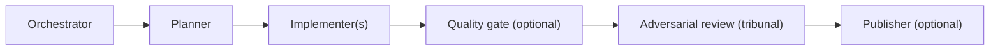
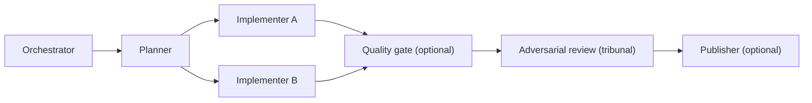
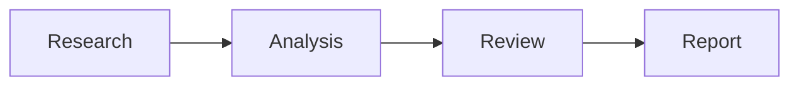
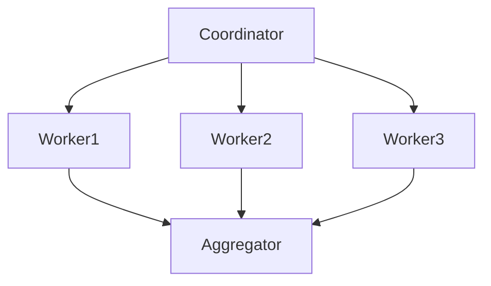
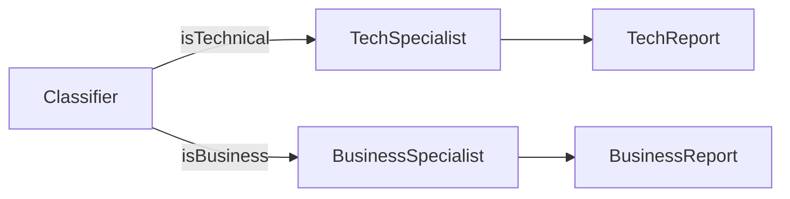
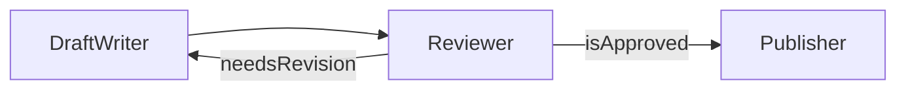
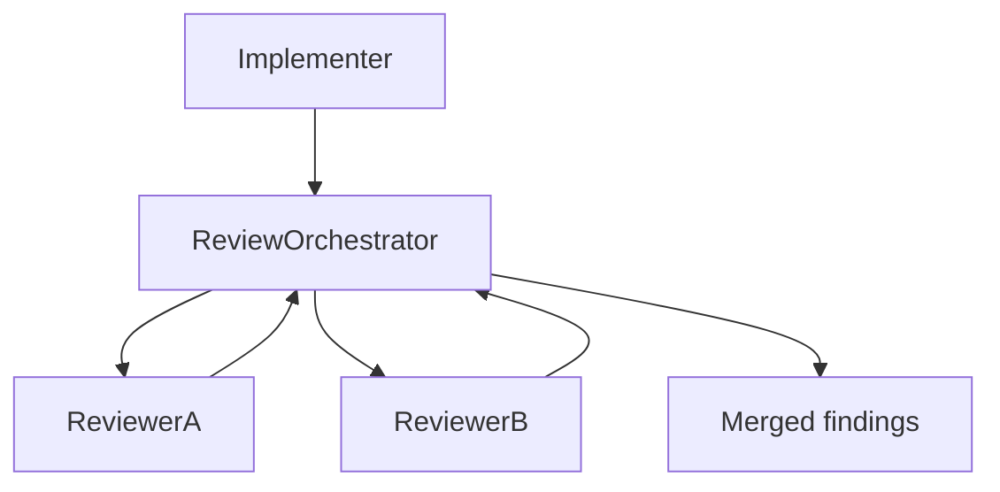

# Graph Topologies

Concepts follow the Strands Agents SDK Graph pattern (nodes = agents/nested graphs/swarms, edges = dependencies), adapted here for hand-scaffolded squads on any harness.

## Mandatory baseline squad shape

Every squad — whatever topology its implementation stages take below — must include three roles:

`Publisher` is an **optional** fifth role, not a mandatory one — only the four rows in the table below are actually required. When present, it's the node that *acts* on the artifact once review passes, rather than validating it: opening a pull request, updating a tracking ticket (Jira, GitHub Issues, ...), publishing/deploying to an environment, or any combination of these. When absent, the orchestrator itself simply concludes and reports back — don't scaffold a dedicated `<squad>-publisher` node unless the design genuinely needs one of these concrete post-review actions; see [scaffolding-workflow.md](scaffolding-workflow.md#1-choose-a-squad-prefix-multiple-squads-coexist-in-one-project) for its naming convention when it is scaffolded.

| Role | Required? | Node type | Validates by |
| --- | --- | --- | --- |
| Orchestrator | Always | Agent | Dispatches/sequences the other nodes; never validates the artifact itself |
| Planner | Always | Agent | Decomposes the task into the implementation stage's node sequence/edges before any implementation work runs |
| Quality gate | Optional (common) | Deterministic custom step — not an LLM agent | Running tools (tests, linters, schema/build/type checks) — no model tokens spent |
| Adversarial review | Always | Nested tribunal (see [Tribunal review](#5-tribunal-review-adversarial-cross-provider) below) | Reasoning over the artifact against review criteria — tokens spent |
| Publisher | Optional | Agent or deterministic tool-execution step, task-specific | N/A — acts on the already-approved artifact (open a PR, update a ticket, publish/deploy) rather than validating it |

Never silently decide either optional role on the task's behalf: ask the user explicitly whether the squad needs a quality gate (and, if so, what it should check — tests, linter, type/schema/build checks, a custom command) and whether it needs a publisher (and, if so, what it should do — open a PR, update a tracking ticket, publish/deploy, or a combination), the same way [harness-implementation.md](harness-implementation.md#always-ask-first-never-assume) requires asking which harness to target. Only after both answers are in hand should a concrete graph be proposed back to the user for approval.

### Implementer stage: one or more agents, parallel when independent

The implementer stage between planner and quality gate/reviewer isn't a single fixed node — the planner's decomposition may produce one implementer agent or several. When two or more implementer subtasks have no dependency on each other's output, dispatch them in parallel (see [Parallel fan-out + aggregation](#2-parallel-fan-out--aggregation) below) rather than serially, and join them with AND semantics before the quality gate/reviewer — both need every implementer's output complete before they can validate.

Only serialize two implementer subtasks when one's output is a genuine input dependency for the other — don't default to sequential dispatch just because the planner produced multiple implementers.

Quality gate vs. adversarial reviewer: when both are present, run the quality gate first — it's cheap (no tokens) and can fail fast on mechanical problems (failing tests, lint errors, a broken build) before spending reasoning tokens on a reviewer that would otherwise flag the same mechanical issues. Route a quality-gate regression back to the implementer(s) (or the planner, for a structural problem) through an explicitly bounded repair loop. If the bound is exhausted, forward the artifact and unresolved gate evidence to the mandatory tribunal with a blocking status; never terminate an implementation run before review. When the repository may have incoming failures, capture a pre-edit baseline and distinguish unchanged baseline failures from new regressions mechanically rather than treating every repo-wide non-zero result as caused by the squad.

The quality gate is not the adversarial reviewer under a different name — it never reasons about the artifact, it only runs deterministic checks and reports pass/fail plus the raw tool output. Scaffolding it is therefore not a delegate-to-agent-authoring-skill step the way every other node is → [scaffolding-workflow.md](scaffolding-workflow.md#6-scaffold-a-quality-gate-node-if-the-design-calls-for-one).

This baseline shape composes with any topology below — e.g. a parallel fan-out topology's implementation stage still ends with a quality gate + adversarial review before its aggregator/publisher; a feedback loop's bounded cycle can sit between the implementer and the quality gate, the reviewer, or both.

## 1. Sequential pipeline

Each node strictly needs its predecessor's output. Entry point (source) is the first node; no fan-out or fan-in.

## 2. Parallel fan-out + aggregation

Independent workers run concurrently after a shared coordinator; the aggregator waits on all of them. This is where **AND vs. OR edge semantics** matter most:

| Semantics | Behavior | Default in |
| --- | --- | --- |
| AND (wait for all) | Target fires only once every incoming edge's source has completed | TypeScript Strands SDK |
| OR (fire on any) | Target fires as soon as any one incoming edge's source completes | Python Strands SDK |

For a join/aggregation node, always require AND semantics explicitly (e.g. `all_dependencies_complete([...])` in Python) — relying on OR-by-default silently runs the aggregator on partial results.

## 3. Branching (conditional edges)

A condition/handler inspects the source node's output and decides whether to traverse an edge. Branches should be exhaustive (every possible classification maps to at least one edge) or the graph stalls with no fired successor.

## 4. Feedback loop (cyclic)

Cyclic graphs require an explicit exit condition (here, `isApproved`) **and** a hard iteration bound (`maxSteps`/equivalent) so a stuck condition can't loop forever.

## 5. Tribunal review (adversarial, cross-provider)

Model a "reviewer" node as a nested tribunal rather than a single agent: a review-orchestrator dispatches the same artifact to two independent reviewer agents in parallel, then merges their findings into one issue list. From the outer graph's perspective the whole subgraph is one opaque node (see [Nested graphs/swarms as nodes](#nested-graphsswarms-as-nodes)).

| Constraint | Reason |
| --- | --- |
| `provider(reviewer-A) != provider(reviewer-B)` | Two reviewers on the same provider/model share the same blind spots and training biases — a same-provider "second opinion" isn't independent |
| `provider(reviewer-A/B) != provider(implementer)` | An agent (or a same-provider sibling) is less likely to catch its own systematic errors; reviewing with a different provider than the one that produced the artifact avoids that correlated blind spot |
| Same review criteria/prompt for A and B | Differences in findings should come from model diversity, not from asking different questions |

The review-orchestrator's merge step: deduplicate overlapping findings, **keep** findings only one reviewer raised (an adversarial pair exists precisely to catch what the other missed), and flag direct disagreements for escalation rather than silently picking one side.

Model/provider assignment guidance → [model-selection.md](model-selection.md#cross-provider-diversity-for-tribunal-review).

## Sources (entry points)

Sources are the nodes that receive the original task input. They are auto-detected as any node with no incoming edges; declare them explicitly when a graph has multiple candidate roots and only one should be the actual entry.

## Nested graphs/swarms as nodes

A node can itself be another graph or a swarm (a looser, non-deterministic multi-agent pattern), enabling hierarchical composition — e.g. a `research_swarm` node feeding a downstream `analysis` node in an otherwise deterministic graph. Treat a nested graph/swarm as a single opaque node when wiring outer edges.

## Cycle-safety checklist

- [ ] Every cyclic edge has a condition that can eventually become false
- [ ] An iteration/step bound exists at the graph level, not just per-node
- [ ] At least one edge out of the cycle leads to a terminal node (e.g. `Publisher`)
