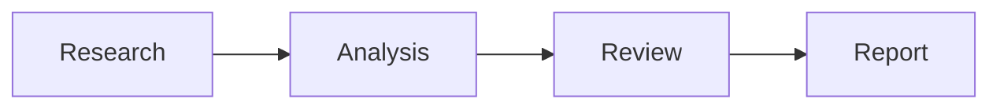
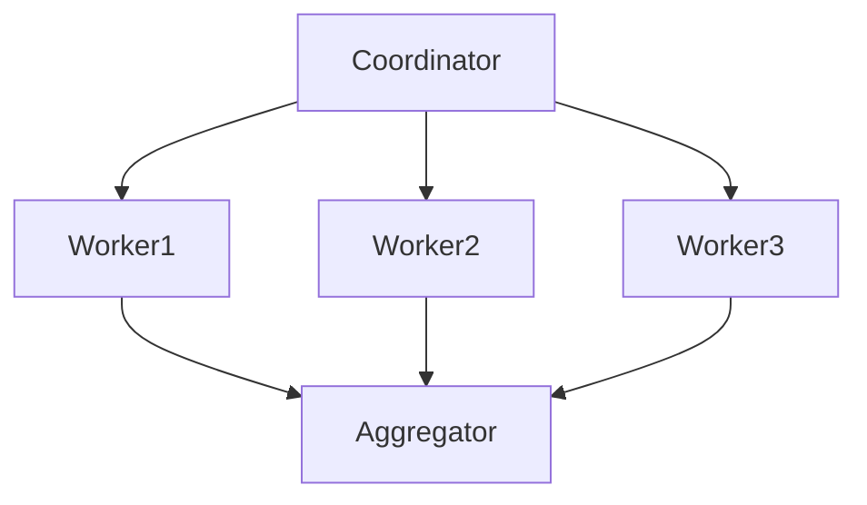
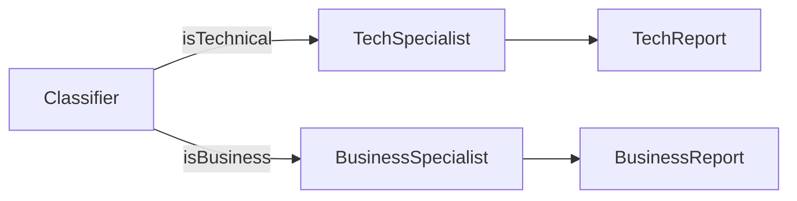
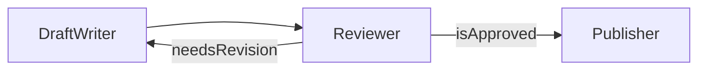
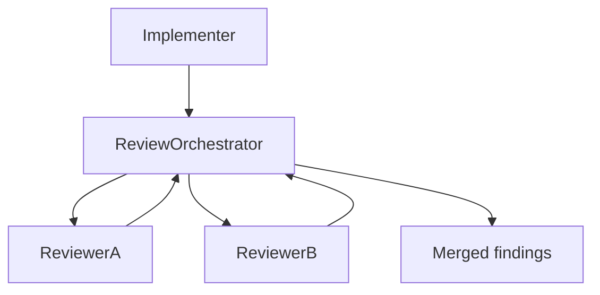

# Graph Topologies

Concepts follow the Strands Agents SDK Graph pattern (nodes = agents/nested graphs/swarms, edges = dependencies), adapted here for hand-scaffolded squads on any harness.

## 1. Sequential pipeline

Each node strictly needs its predecessor's output. Entry point (source) is the first node; no fan-out or fan-in.

## 2. Parallel fan-out + aggregation

Independent workers run concurrently after a shared coordinator; the aggregator waits on all of them. This is where **AND vs. OR edge semantics** matter most:

| Semantics | Behavior | Default in |
| --- | --- | --- |
| AND (wait for all) | Target fires only once every incoming edge's source has completed | TypeScript Strands SDK |
| OR (fire on any) | Target fires as soon as any one incoming edge's source completes | Python Strands SDK |

For a join/aggregation node, always require AND semantics explicitly (e.g. `all_dependencies_complete([...])` in Python) — relying on OR-by-default silently runs the aggregator on partial results.

## 3. Branching (conditional edges)

A condition/handler inspects the source node's output and decides whether to traverse an edge. Branches should be exhaustive (every possible classification maps to at least one edge) or the graph stalls with no fired successor.

## 4. Feedback loop (cyclic)

Cyclic graphs require an explicit exit condition (here, `isApproved`) **and** a hard iteration bound (`maxSteps`/equivalent) so a stuck condition can't loop forever.

## 5. Tribunal review (adversarial, cross-provider)

Model a "reviewer" node as a nested tribunal rather than a single agent: a review-orchestrator dispatches the same artifact to two independent reviewer agents in parallel, then merges their findings into one issue list. From the outer graph's perspective the whole subgraph is one opaque node (see [Nested graphs/swarms as nodes](#nested-graphsswarms-as-nodes)).

| Constraint | Reason |
| --- | --- |
| `provider(reviewer-A) != provider(reviewer-B)` | Two reviewers on the same provider/model share the same blind spots and training biases — a same-provider "second opinion" isn't independent |
| `provider(reviewer-A/B) != provider(implementer)` | An agent (or a same-provider sibling) is less likely to catch its own systematic errors; reviewing with a different provider than the one that produced the artifact avoids that correlated blind spot |
| Same review criteria/prompt for A and B | Differences in findings should come from model diversity, not from asking different questions |

The review-orchestrator's merge step: deduplicate overlapping findings, **keep** findings only one reviewer raised (an adversarial pair exists precisely to catch what the other missed), and flag direct disagreements for escalation rather than silently picking one side.

Model/provider assignment guidance → [model-selection.md](model-selection.md#cross-provider-diversity-for-tribunal-review).

## Sources (entry points)

Sources are the nodes that receive the original task input. They are auto-detected as any node with no incoming edges; declare them explicitly when a graph has multiple candidate roots and only one should be the actual entry.

## Nested graphs/swarms as nodes

A node can itself be another graph or a swarm (a looser, non-deterministic multi-agent pattern), enabling hierarchical composition — e.g. a `research_swarm` node feeding a downstream `analysis` node in an otherwise deterministic graph. Treat a nested graph/swarm as a single opaque node when wiring outer edges.

## Cycle-safety checklist

- [ ] Every cyclic edge has a condition that can eventually become false
- [ ] An iteration/step bound exists at the graph level, not just per-node
- [ ] At least one edge out of the cycle leads to a terminal node (e.g. `Publisher`)
