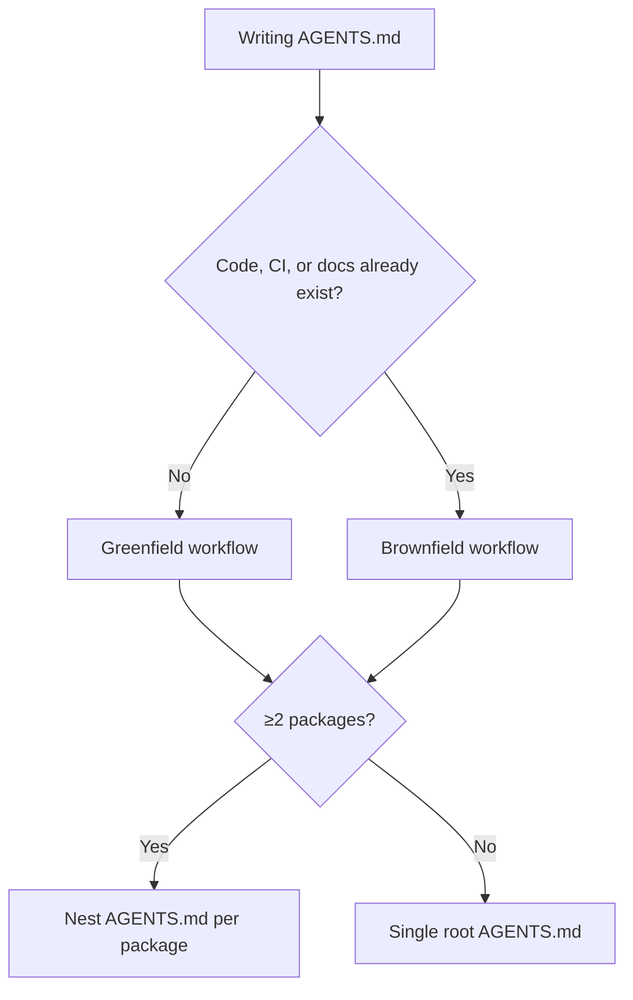

# AGENTS.md

A README for agents: plain Markdown, no required fields, read by 20+ coding agents (Codex, Cursor, Copilot, Aider, Gemini CLI, Windsurf, Devin, and more).

## Quick Facts

| Fact | Detail |
|------|--------|
| Location | `AGENTS.md` at repo root; additional copies nested per package/subproject |
| Discovery | Agent reads the nearest `AGENTS.md` up the directory tree from the file it's editing |
| Precedence | Closest file to the edited file wins; explicit chat/user instructions override everything |
| Format | Standard Markdown, any headings, no schema to validate |
| Execution | Agents run commands listed in it (tests, lint) and try to fix failures before finishing |

## Workflow Picker

| Situation | Use |
|-----------|-----|
| No code yet / scaffolding a new repo | [Greenfield workflow](references/authoring-workflow.md#greenfield-workflow) |
| Existing codebase, README/CI/CLAUDE.md already exist | [Brownfield workflow](references/authoring-workflow.md#brownfield-workflow) |
| Monorepo with multiple packages | [Nesting rules](references/anatomy-and-discovery.md#monorepo-nesting) |
| Migrating from AGENT.md, CLAUDE.md, `.cursor/rules`, `copilot-instructions.md` | [Legacy migration](references/anatomy-and-discovery.md#migrating-legacy-files) |

## Core Principle

Never hardcode language, framework, or tool assumptions into an AGENTS.md — every instruction must reflect the target repo's actual, verified stack and commands, not a generic template left unfilled.

AGENTS.md is still a Markdown file: run `markdown-best-practices` over the draft before treating it as finished (heading spacing, table/list consistency, fenced-code language tags).

## Reference Files

| File | Load When |
|------|-----------|
| [references/anatomy-and-discovery.md](references/anatomy-and-discovery.md) | Deciding where files live, how precedence works, or migrating from a legacy agent file |
| [references/authoring-workflow.md](references/authoring-workflow.md) | Writing a new AGENTS.md for a greenfield or brownfield project |
| [references/writing-style.md](references/writing-style.md) | Wording and formatting an AGENTS.md section for density and scannability |
| [references/quality-and-security.md](references/quality-and-security.md) | Reviewing content quality, verifying commands, or covering security considerations |
