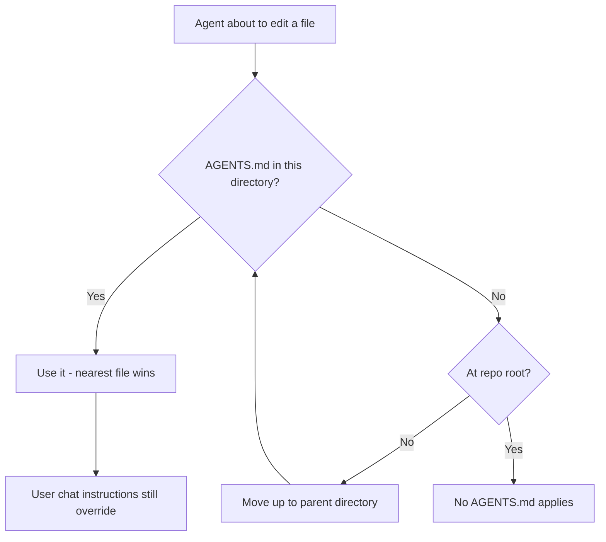

# Anatomy & Discovery

## Placement

| Scope | Path | Applies To |
|-------|------|-----------|
| Repo-wide | `AGENTS.md` at repo root | Every file in the repo, unless overridden by a nested file |
| Subproject | `<package>/AGENTS.md` | That package/directory subtree only |
| Deeply nested | `<package>/<module>/AGENTS.md` | That module subtree only |

## Discovery & Precedence

Agents walk up from the file being edited to find the nearest `AGENTS.md`; the closest file wins on conflict (some tools also surface the root file for extra context, but precedence goes to the nearest). Explicit user chat instructions override every `AGENTS.md`, always. No required fields or schema — any heading structure is valid; agents parse plain text.



## Monorepo Nesting

```text
repo/
├── AGENTS.md                 # org-wide conventions: commit style, security, shared tooling
├── packages/
│   ├── api/
│   │   └── AGENTS.md          # api-specific build/test/lint commands
│   └── web/
│       └── AGENTS.md          # web-specific build/test/lint commands
└── infra/
    └── AGENTS.md               # IaC-specific conventions
```

Rules:

- Add a nested file only when a subproject's commands/conventions genuinely diverge from the root.
- A nested file should cover **deltas only** — don't repeat root-level content (PR title format, security rules) that already applies repo-wide.
- Large orgs ship many nested files (OpenAI's Codex repo has 88+); this scales better than one sprawling root file.

## Migrating Legacy Files

Many tools historically used their own filename. Consolidate onto `AGENTS.md` and keep a pointer file for backward compatibility:

```bash
mv AGENT.md AGENTS.md && ln -s AGENTS.md AGENT.md
```

For Claude Code, prefer a `CLAUDE.md` containing only Claude's `@`-import directive over a symlink — it survives zip downloads and Windows checkouts without symlink support. Ask the user whether Claude compatibility is needed before adding it:

```markdown
@AGENTS.md
```

If yes, pair this `CLAUDE.md` with every `AGENTS.md` in the repo, including nested ones — one `CLAUDE.md` + `@AGENTS.md` per directory that has its own `AGENTS.md`.

| Legacy File | Tool | Migration |
|-------------|------|-----------|
| `AGENT.md` | Various early adopters | Rename + symlink |
| `CLAUDE.md` | Claude Code | Pair with `@AGENTS.md` import (not a symlink) |
| `.cursor/rules` | Cursor | Fold content into `AGENTS.md`; Cursor also reads it natively |
| `.github/copilot-instructions.md` | GitHub Copilot | Keep both if repo targets multiple agents, or fold into `AGENTS.md` |
| `.aider.conf.yml` | Aider | Add `read: AGENTS.md` to point Aider at the shared file |
| `.gemini/settings.json` | Gemini CLI | Add `{ "context": { "fileName": "AGENTS.md" } }` |

Prefer one canonical `AGENTS.md` per directory scope; use symlinks or import directives rather than maintaining duplicate content across tool-specific files.
