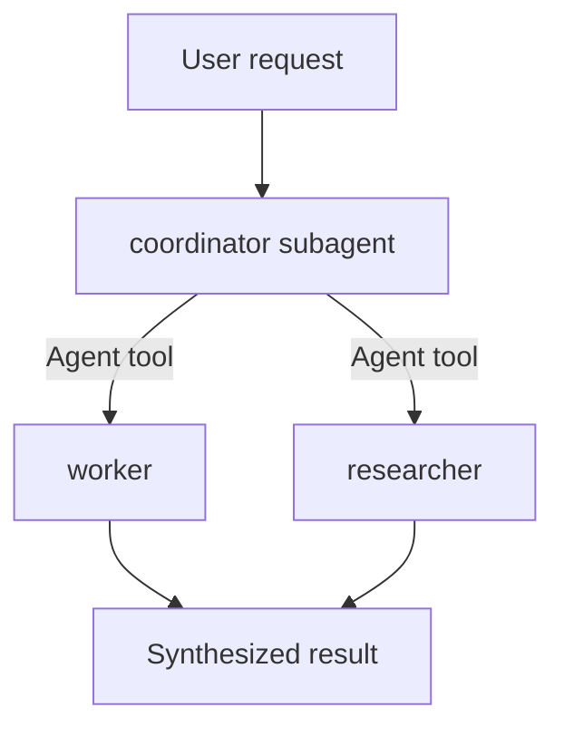

# Delegation & Squads

## Nested subagents

A subagent can spawn subagents of its own by default, up to 3 layers below the main conversation (`CLAUDE_CODE_MAX_SUBAGENT_SPAWN_DEPTH`, set `1` to disable nesting entirely). At the depth limit, Claude Code withholds the `Agent` tool from every subagent except a [fork](#forks-vs-named-subagents). Nested subagents suit a delegated task that itself splits into parallel subtasks (e.g. a reviewer that dispatches a verifier per finding) so only the top-level summary reaches you.

## Coordinator + specialist pattern



```markdown
---
name: coordinator
description: Coordinates work across specialized agents for multi-step tasks.
tools: Agent(worker, researcher), Read, Bash
---

You coordinate a squad of specialists. For each request, decide which
specialists apply, dispatch each via the Agent tool, then synthesize
their findings into one report.
```

`Agent(worker, researcher)` in `tools` allowlists exactly those two subagent types for this coordinator — any other dispatch request fails and the coordinator sees only the allowed types in its own prompt. Full field mechanics (bare `Agent`, omitting it, and the main-thread-only scope of this syntax) → [frontmatter-reference.md](frontmatter-reference.md#restrict-which-subagents-a-coordinator-can-spawn).

To block specific subagents session-wide instead (for every caller, not just one coordinator), use `permissions.deny: ["Agent(subagent-name)"]` in settings — this is a hard block, unlike the allowlist above which is scoped to one coordinator's own dispatch.

## Concurrency & limits

| Limit | Default | Variable |
| --- | --- | --- |
| Nesting depth | 3 layers below main conversation | `CLAUDE_CODE_MAX_SUBAGENT_SPAWN_DEPTH` |
| Concurrent running subagents | 20 | `CLAUDE_CODE_MAX_CONCURRENT_SUBAGENTS` (exempt when `ultracode` effort is active) |

There is no limit on the total subagents spawned over a session — only how many run at once and how deep they nest.

## Resuming a subagent

A completed subagent keeps its agent ID; Claude uses the `SendMessage` tool with that ID (or name) to resume it with full prior context, rather than starting fresh. A subagent you stopped yourself (`x` in `/tasks`) does not auto-resume from a `SendMessage` — you must type into its transcript first. `SendMessage` verifies the name still refers to the same agent instance before delivering, refusing rather than misdirecting if a newer agent reused the name.

## Forks vs. named subagents

A **fork** (`/subtask`, requires opt-in on older versions) inherits the entire parent conversation instead of starting fresh — same system prompt, tools, model, and prompt cache. Use a fork when a named subagent would need too much re-explained background; use a named subagent for a role with its own stable prompt/tools/model reused across many tasks. Forks can't spawn further forks and skip both subagent tool-filters (full parent tool pool, foreground-or-background rules don't apply the same way).

## Agent teams (out of scope here)

Agent teams are a separate, session-spanning multi-agent feature (teammates that persist and message each other via `SendMessage`/task tools) — distinct from the request-scoped subagents this skill covers. A subagent *definition* can be reused as a teammate's base config, but authoring a team's coordination protocol is not covered by this skill.
