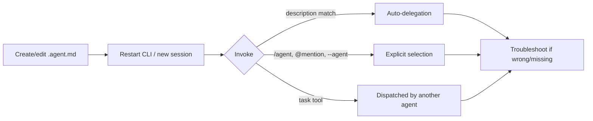

# Authoring Workflow

## Create an agent

| Method | How |
| --- | --- |
| Interactive wizard | `/agent` → create → choose Project (`.github/agents/`) or User (`~/.copilot/agents/`) scope → fill description/tools in a guided form |
| Manual file | Create `.github/agents/<name>.agent.md` (or `.md`) directly with frontmatter + prompt body |
| Via `configure-copilot` | Ask the built-in `configure-copilot` agent to scaffold a new agent for you |
| Via a plugin | Ship agents under `<plugin>/agents/` so `apm`/plugin installs distribute them automatically (lowest load priority — a project or user agent with the same filename overrides it) |

Naming: lowercase, hyphenated; filename → agent ID (`react-reviewer.agent.md` → `react-reviewer`). Nested subdirectories under `.github/agents/`/`.claude/agents/` are discovered recursively, even when the session starts from a subdirectory of the repo root.

## Load & reload

| Trigger | Effect |
| --- | --- |
| Restart CLI / new session | Only way to pick up new or edited agent files mid-work |
| `/clear`, `/new` | Also reset which agent is currently selected |
| `/cd` | Re-discovers agents in the new directory; persists that directory across a resumed session |

## Invoke & verify

1. `/agent` — browse and select an agent by display name; if the filename differs from the display name, the source label still shows which file it came from.
2. `@agent-name your prompt` — explicit inline invocation.
3. `copilot --agent <name> --prompt "..."` — non-interactive/scripted invocation.
4. Just ask naturally and let auto-delegation match your `description` — this is the only way to verify the description is actually trigger-worthy; if the CLI doesn't pick it, tighten the wording (see [frontmatter-reference.md](frontmatter-reference.md)).
5. `/subagents` (alias `/agents`) — configure per-agent model/reasoning-effort/context-tier, and see which agents are registered.

## Troubleshooting

| Symptom | Cause / fix |
| --- | --- |
| Agent never auto-invoked | `description` too generic, or `disable-model-invocation: true`/`infer: false` set. Since v1.0.42 the CLI is also more conservative about delegating at all — see [delegation-and-squads.md](delegation-and-squads.md). |
| Agent missing from `/agent` picker | `user-invocable: false` — by design, still reachable via `task`. |
| Edits keep going through the wrong agent's constraints | Confirm file location priority: project `.github/agents/` (deepest ancestor) > `.claude/agents/` > user `~/.copilot/agents/` > plugin. A same-named agent higher in this order silently wins. |
| "Malformed custom agent" warning | Parse error is now surfaced (not silently skipped); check YAML frontmatter syntax — unknown *fields* only warn, but invalid YAML structure blocks loading. |
| Agent stuck on the wrong model after a session resume | Confirmed fixed for BYOK/BYOM providers in later versions — update the CLI if you still see this with a pinned `model:`. |
| Plugin-provided agent not appearing | Confirm the plugin is installed/enabled (`/plugin list`) and that no project/user agent with the same filename is shadowing it. |

## Testing before you rely on delegation

- Restart the CLI after any edit.
- Ask a question that should trigger auto-delegation and confirm the right agent name appears in the timeline/statusline (agent name is visible in the footer and toggleable via `/statusline`).
- Ask a question that should *not* trigger it, to catch an over-broad description.
- For orchestrators, confirm they dispatch implementation via `task` rather than doing the work inline. Always strip `edit`; strip `shell`/`bash` unless the prompt defines a narrow orchestrator-owned dependency readiness preflight, in which case verify shell use is explicitly forbidden after that preflight.
