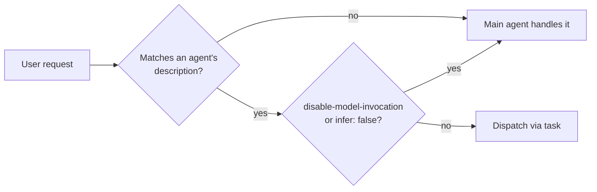
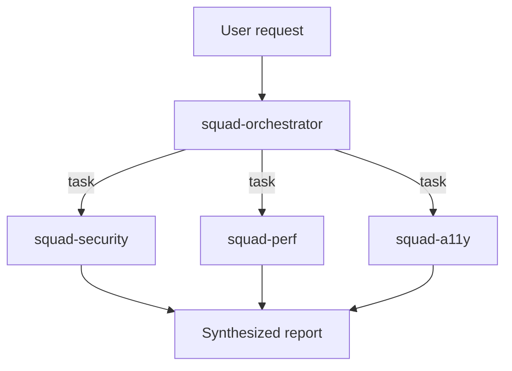

# Delegation & Squads

## How auto-delegation works



Same routing discipline as skills → write `description` with concrete trigger phrases ("Use for security audits, `seccheck`, vulnerability review requests"), not job titles.

Since v1.0.42 the CLI is more selective about delegating at all — it weighs whether a task is genuinely separable/parallelizable before spinning up a subagent, vs. delegating eagerly. Effect: an orchestrator that still has `edit`/`bash` in its `tools:` will often just do the work itself. **Strip `edit`/`shell`/`bash` from an orchestrator's `tools:`** so it has no option but to delegate.

## Built-in agents

| Agent | Role |
| --- | --- |
| `explore` | Read-only codebase exploration/Q&A |
| `task` | Generic task execution subagent |
| `general-purpose` | Default fallback subagent for miscellaneous work |
| `code-review` | Reviews diffs/staged changes |
| `research` | Orchestrator/subagent deep-research pattern, invoked via `/research` |
| `rubber-duck` | Talk-through-the-problem persona; configurable in `/subagents` with a complementary model strategy (picks an opposite-family model from the main session) |
| `security-review` | Security-focused review persona |
| `configure-copilot` | Manages MCP servers, custom agents, and skills via the `task` tool — **not listed in the official built-in-agents table**, confirmed only via changelog |

Disable specific built-ins with `--disable-agent task,explore` (or the equivalent setting) if you want to force your own custom agents to be used instead.

## The `task` tool (dispatch)

```text
task(agent_type="react-reviewer", prompt="Review src/components/Cart.tsx for hook misuse")
```

`task` takes exactly two parameters:

| Parameter | Purpose |
| --- | --- |
| `agent_type` | A built-in name (`explore`, `general-purpose`, …) or any custom agent ID (filename minus extension) visible at the current location priority |
| `prompt` | The task for the subagent to run — see below, this is the *only* channel of information into it |

Subagent runs get human-readable IDs based on the agent name (`react-reviewer-0`, not a generic `agent-0`). Nested subagents inherit the parent's tool restrictions and keep their own `model`/`reasoning-effort` across a resumed session, including with BYOK/BYOM providers. Since [v1.0.19](https://github.com/github/copilot-cli/issues/690), `agent_type` can name any custom agent in the repo, not just built-ins — this is what makes the orchestrator + specialist squad pattern below possible.

### `prompt` is the only communication channel

Each `task` dispatch starts the subagent in a fresh, empty context — it does **not** inherit the orchestrator's conversation history, prior tool results, or file reads. `prompt` is the only information the subagent gets. Whatever the orchestrator has already learned (a research finding, a file path, a task brief) must be written explicitly into `prompt`, or the orchestrator must point the subagent at a file it can read for itself (e.g. a shared plan on disk).

```text
# Bad — the specialist has no idea what "it" refers to
task(agent_type="squad-implementer", prompt="Now implement it")

# Good — self-contained: states the goal and names the supporting file
task(agent_type="squad-implementer", prompt="Implement the plan in
/memories/session/squad-plan.md. Run tests after each file change.")
```

This is the same discipline VS Code enforces with `vscode/memory` writes before a handoff — the CLI has no equivalent shared-memory tool, so the orchestrator's `prompt` composition is the entire hand-off mechanism.

## Agent-to-agent communication

| Tool | Purpose |
| --- | --- |
| `list_agents` | List agents visible to the caller — scoped to self, sibling, or child relations |
| `read_agent` | Poll a running background agent for status/output |
| `write_agent` | Send a follow-up message to an already-running agent (multi-turn subagents are always enabled — you can message a subagent while it's still working) |

## Orchestrator + specialist squad pattern



```markdown
---
description: Orchestrates code-quality squads. Dispatches to squad-* specialists; never edits files itself.
tools: ['read', 'search', 'task', 'list_agents']
---

You coordinate a squad of specialists (squad-security, squad-perf, squad-a11y).
For each request, decide which specialists apply, dispatch each via `task`,
then synthesize their findings into one report. Never edit files directly —
always delegate implementation work to a specialist.
```

```markdown
---
name: squad-security
description: Security specialist. Reviews code for OWASP Top 10 issues; used by the code-quality orchestrator.
tools: ['read', 'search']
user-invocable: false
---

You are the security specialist in a review squad...
```

Conventions that substitute for the CLI's missing `agents:` allowlist:

| Convention | Effect |
| --- | --- |
| Naming prefix (`squad-*`) | Makes intended callers/callees obvious in the orchestrator prompt & directory listing |
| `user-invocable: false` on specialists | Hides them from `/agent` picker & `@mention` — reachable only via `task`, so users go through the orchestrator |
| Narrow `tools:` on specialists (no `task`) | Prevents specialists from spawning their own sub-squads unless intended |

No allowlist ⇒ *any* agent with `task` can still dispatch to `squad-security` directly — this is a convention, not a hard security boundary.

## Parallel dispatch: `/fleet`

`/fleet` runs multiple subagents concurrently for large/parallelizable jobs (e.g., "review every file changed in this PR" → one subagent per file). The fleet orchestrator validates subagent work before folding results back into the main session, and dispatches more subagents in parallel as of later versions for faster completion. Use it interactively — it isn't an agent frontmatter field.

## Limits

| Limit | Default | Notes |
| --- | --- | --- |
| Max subagent nesting depth | `4` | Lowered from `6` to curb runaway recursive delegation; usage-based billing users can raise it (up to `128`) via `subagents.maxDepth` in settings or `/settings`. |
| Max concurrent subagents | Plan-dependent | Configurable via `/settings` (usage-based billing users) |

Configure per-agent model/reasoning-effort/context-tier overrides interactively via `/subagents` (aliased `/agents`), which persists to `~/.copilot/settings.json` under `subagents.agents.<name>`.
