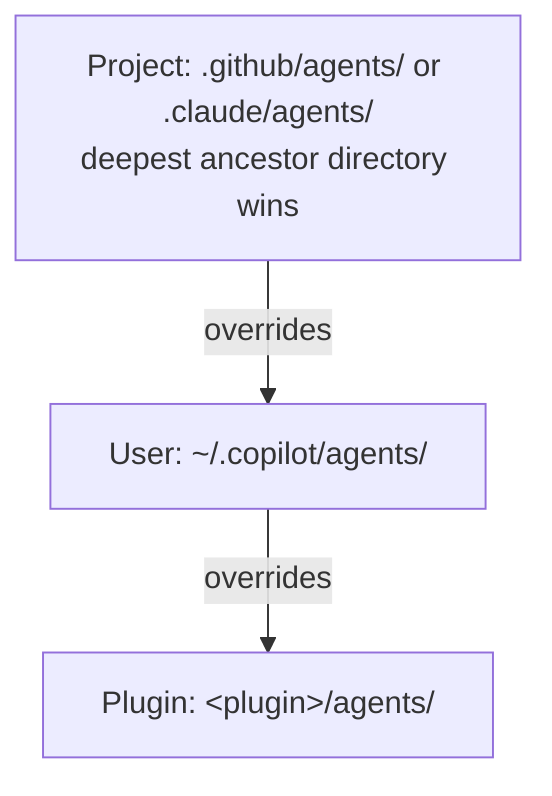

# Frontmatter Reference

Source: [CLI command reference §Custom agents reference](https://docs.github.com/en/copilot/reference/copilot-cli-reference/cli-command-reference#custom-agents-reference) and [§Tool availability values](https://docs.github.com/en/copilot/reference/copilot-cli-reference/cli-command-reference#tool-availability-values), cross-checked against `github/copilot-cli`'s own `changelog.md` (verified current as of CLI v1.0.79).

## Core fields

| Field | Type | Default | Notes |
| --- | --- | --- | --- |
| `description` | string | — (required) | Shown in the agent list and to the `task` tool; the CLI routes auto-delegation on this text alone — be specific about scope/triggers, not vague ("Backend developer" won't trigger). |
| `name` | string | filename | Display label shown in the `/agent` picker and agent list — doesn't need to match the filename (which is still the agent's ID for `task(agent_type=...)`/`@mention`). Keep it short but meaningful; spaces are allowed (e.g. `name: Security Review`). |
| `model` | string | inherits parent | Single model string. Accepts short IDs (`claude-sonnet-4.6`) or display names with vendor suffix (`"GPT-5.4 (copilot)"`). When the session model is `Auto`, subagents always use the resolved session model regardless of this field. |
| `tools` | string[] | `["*"]` (all) | See [Tools](#tools) below. |
| `mcp-servers` | object | — | Same schema as `~/.copilot/mcp-config.json`; merges with configured servers. |
| `disable-model-invocation` | boolean | `false` | Prevents the main agent (and `task`) from auto-invoking this agent. Since CLI has no `agents:` allowlist, this removes the agent from model dispatch **entirely** — there's no "only orchestrator X" exception. |
| `user-invocable` | boolean | `true` | `false` hides the agent from the `/agent` picker; it stays reachable via `task(agent_type=...)`. Use this (not `disable-model-invocation`) to hide internal specialists while keeping them dispatchable. |
| `infer` | boolean | `true` | Legacy alias for `!disable-model-invocation`, kept for backward compatibility since 0.0.411. Prefer `disable-model-invocation` in new agents. |

## Additional fields (changelog-confirmed, thin/absent in the official table)

| Field | Type | Notes |
| --- | --- | --- |
| `deferred-tool-loading` | boolean | Opt-in tool-search discovery instead of loading the full tool list up front — for agents with a large `tools:` list. |
| `skills` | string[] | Eagerly load named skill content into the agent's context at startup (vs. the default on-demand skill loading). |
| `reasoning-effort` | string | `low`/`medium`/`high`/`xhigh`/`max` (model-dependent); sets the agent's reasoning effort independent of the session's `--reasoning-effort`. |
| `sidekick` | object | Turns the file into a background sidekick agent (see below) instead of a normal task-dispatchable agent. |

## Sidekick agents

A `sidekick:` block makes the agent run automatically in response to session events rather than being explicitly invoked.

```yaml
sidekick:
  triggers:
    - session.context_changed
    - event: user.message
      limit: 1
  behavior: persistent   # "restart" (default) | "persistent"
  maxSendsPerTurn: 2
```

| Sub-field | Values |
| --- | --- |
| `triggers` | `user.message` (every message) or `session.context_changed` (cwd/repo/branch change); entries can be a bare event string (unlimited fires) or `{event, limit}` |
| `behavior` | `restart` (cancel + relaunch fresh each trigger, for stateless gatherers) or `persistent` (one long-lived loop, state accumulates) |
| `maxSendsPerTurn` | Max inbox sends per trigger (default `1`); resets each delivered message in `persistent` mode |

> The CLI has no `target:`, `agents:` allowlist, `handoffs:`, or model fallback-chain array — don't add them to a CLI agent file, they're silently ignored. Enforce a specialist hierarchy by convention instead (naming prefix + `user-invocable: false`). For per-agent model resilience use `~/.copilot/settings.json` → `subagents.agents.<name>.model` rather than an inline fallback list.

## Tools

`tools:` accepts a YAML array or comma-separated string of the CLI's built-in **tool availability values** (the same identifiers used by `--available-tools`/`--excluded-tools`) plus `mcp-server-name/tool-name`. Omit `tools:` for all tools; `[]` disables all tools.

### Shell tools

| Tool | Purpose |
| --- | --- |
| `bash` / `powershell` | Execute commands |
| `list_bash`/`list_powershell` | List active shell sessions |
| `read_bash`/`read_powershell` | Read output from a shell session |
| `stop_bash`/`stop_powershell` | Terminate a shell session |
| `write_bash`/`write_powershell` | Send input to a shell session |

### File operation tools

| Tool | Purpose |
| --- | --- |
| `apply_patch` | Apply patches (used by some models instead of `edit`/`create`) |
| `create` | Create new files |
| `edit` | Edit files via string replacement |
| `view` | Read files or directories |

### Agent/task delegation & other tools

| Tool | Purpose |
| --- | --- |
| `list_agents` | List visible agents (self/sibling/child) |
| `read_agent` | Check a background agent's status |
| `task` | Dispatch a subagent (built-in or custom) |
| `write_agent` | Send a message to a running agent |
| `ask_user` | Ask the user a question |
| `glob` | Find files matching patterns |
| `grep` (or `rg`) | Search for text in files |
| `skill` | Invoke a custom skill |
| `web_fetch` | Fetch/parse a URL |

Unrecognized tool names are ignored rather than erroring. MCP server tools: reference `some-mcp-server/some-tool`, or `some-mcp-server/*` for all of a server's tools.

> **Don't confuse this list with `--allow-tool`/`--deny-tool` permission patterns.** Those use a different, coarser `Kind(argument)` syntax — `memory`, `read`, `shell(git:*)`, `url(github.com)`, `write(src/*.ts)`, `SERVER-NAME` — for session-level allow/deny rules, not for the agent frontmatter `tools:` list. Writing `tools: ['shell(git:*)']` in an agent file is invalid; use `tools: ['bash']` instead.

## Locations & priority



| Scope | Location |
| --- | --- |
| Project | `.github/agents/` or `.claude/agents/`, walked upward from cwd to the Git root; `.github/agents/` beats `.claude/agents/` at the same level |
| User | `~/.copilot/agents/` |
| Plugin | `<plugin>/agents/` |

Name collisions resolve by this priority order (not "first found wins" like skills). Malformed frontmatter shows a real parse error (not a silent skip) as of later CLI versions; unknown fields warn instead of blocking the agent from loading.
