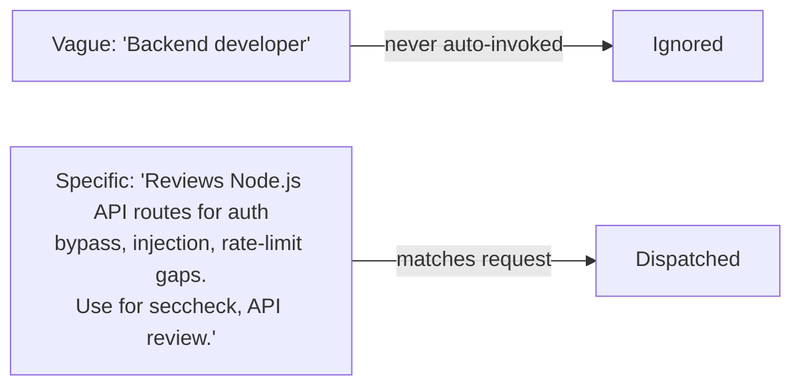

# Writing Style for Custom Agents

Two distinct texts to get right: the `description` (routes delegation) and the prompt body (shapes behavior). Same discipline as writing a good `SKILL.md` — specific > generic, active voice, no restatement. The whole `.agent.md` is re-read into context every invocation, so write it as compactly as the facts allow: tables over prose, no preamble, no restated frontmatter.

## `description` field

| Rule | Do | Don't |
| --- | --- | --- |
| Trigger phrases, not titles | "Use for security audits, `seccheck`, vulnerability review requests" | "Backend developer" |
| State the boundary | "...; never edits files" / "...; only for React components" | Leaving scope implicit — invites wrong dispatches |
| Keyword-dense | Include synonyms/slash-command names/jargon a user would actually type | One abstract sentence |
| Exclude overlaps | "DO NOT USE FOR: performance work (use `perf-reviewer`)" when a sibling agent is easily confused with this one | Letting two agents' descriptions overlap unbounded |
| Length | 1–3 sentences | A paragraph — the CLI matches on this text every turn; bloat dilutes the signal |



## Prompt body

| Section | Purpose | Keep it to |
| --- | --- | --- |
| Role (first line) | One sentence identity: "You are a \<role\> focused on \<scope\>." | 1 sentence |
| Protocol | Numbered steps if the task is multi-step; skip if single-shot | ≤7 steps |
| Constraints | Explicit prohibitions — what this agent must NOT do | Bullet list, imperative |
| Output format | Table/schema the orchestrator or user expects back | 1 short example if non-obvious |

```markdown
You are a security reviewer. Identify vulnerabilities following the OWASP Top 10
taxonomy. Report findings in a table with severity, location, and remediation.
Do NOT modify files.
```

## Rules

| Rule | Do | Don't |
| --- | --- | --- |
| Active, imperative voice | "Identify vulnerabilities" | "Vulnerabilities should be identified" |
| No tool restatement | Let `tools:` frontmatter speak for itself | "You have access to read and search tools..." in the body |
| Explicit stop conditions | "Never edit files", "Stop after producing the report" | Leaving an orchestrator free to also implement fixes |
| One role per agent | Split into a squad (see [delegation-and-squads.md](delegation-and-squads.md)) when a prompt starts listing unrelated responsibilities | A single agent that reviews security, perf, and a11y in one body |
| Orchestrator prompts name their specialists | "Dispatch to squad-security, squad-perf, squad-a11y via `task`" | "Dispatch to the right specialist" — too vague to route reliably |
| Sidekick prompts declare their trigger intent | State what event should make it act ("react when the repo/branch changes") | Writing a sidekick prompt identical to a normal on-demand agent |
| Mermaid over prose | A flowchart for routing/dispatch logic or squad topology ([delegation-and-squads.md](delegation-and-squads.md)) | A diagram for facts that fit a table (frontmatter fields, tool lists) |

## Anti-patterns

- Description that's just the agent's `name` reworded ("The React Reviewer reviews React code")
- Prompt body re-explaining frontmatter fields (`model`, `tools`) instead of behavior
- No stated constraints on a specialist that shares `tools: ['edit']` with the orchestrator
- History/motivation preamble in the prompt body ("This agent was created to help with...")
- Missing exclusion phrase when two agents could plausibly both match the same request
