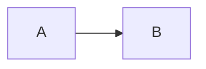

# Mermaid Diagrams

Mermaid diagrams render natively in GitHub, VS Code, and Copilot Chat markdown from a plain ` ```mermaid ` fenced code block — no image files, no external tools. For an agent, a diagram is also a token-efficient way to convey structure: a 10-line flowchart replaces a paragraph of prose while staying unambiguous for both the human reader and the next agent that reads the file.

Every diagram in this skill is stable in current Mermaid — none require the `-beta` suffix keyword or carry an "experimental/may evolve" warning in the official docs. Experimental diagram types are deliberately excluded (see frontmatter).

## Anatomy

| File | Purpose |
| --- | --- |
| SKILL.md | Decision table, fence basics, reference index |
| [references/structure-and-data.md](references/structure-and-data.md) | Flowchart, Class, State, Entity Relationship, Block |
| [references/process-and-time.md](references/process-and-time.md) | Sequence, GitGraph, Event Modeling, User Journey |
| [references/planning-and-tracking.md](references/planning-and-tracking.md) | Gantt, Kanban, Requirement |
| [references/charts-and-comparison.md](references/charts-and-comparison.md) | Pie, Quadrant, XY Chart, Packet |

## Fence Basics

````markdown

````

The first line inside the fence is always the diagram's keyword (`flowchart`, `sequenceDiagram`, `classDiagram`, ...) — this is what selects the diagram type; everything else is that diagram's own syntax.

This skill only covers syntax inside the fence — run `markdown-best-practices` over the surrounding file (blank lines around the fence, heading/list hygiene) before treating the edit as finished.

## Which Diagram? (Quick Reference)

| Diagram | Keyword | Use When |
| --- | --- | --- |
| Flowchart | `flowchart` / `graph` | Show branching logic, a process, or a decision tree |
| Sequence | `sequenceDiagram` | Show ordered messages/calls between actors or systems over time |
| Class | `classDiagram` | Model OOP classes: attributes, methods, and relationships |
| State | `stateDiagram-v2` | Model the states of one entity and its transitions |
| Entity Relationship | `erDiagram` | Model database entities and their relationships/cardinality |
| User Journey | `journey` | Show a user's steps and satisfaction across a task |
| Gantt | `gantt` | Show a project schedule: task durations and dependencies over calendar time |
| Pie | `pie` | Show proportions of a whole across categories |
| Quadrant | `quadrantChart` | Plot items on two axes to prioritize or categorize them |
| Requirement | `requirementDiagram` | Trace SysML-style requirements to the elements that satisfy/verify them |
| GitGraph | `gitGraph` | Visualize a branch/commit/merge history |
| Block | `block` | Freeform architecture/system diagram needing manual layout control |
| Packet | `packet` | Show the byte/bit layout of a network packet or binary format |
| Kanban | `kanban` | Show a task board with columns (Todo/In Progress/Done) |
| XY Chart | `xychart` | Plot numeric bar/line data across two axes |
| Event Modeling | `eventmodeling` | Show a UI → Command → Event timeline for an event-sourced system |

## Reference Files

| File | Load When |
| --- | --- |
| [references/structure-and-data.md](references/structure-and-data.md) | Documenting code structure, a data model, or a component layout |
| [references/process-and-time.md](references/process-and-time.md) | Documenting an interaction, a history, or a flow over time |
| [references/planning-and-tracking.md](references/planning-and-tracking.md) | Documenting a schedule, a task board, or formal requirements |
| [references/charts-and-comparison.md](references/charts-and-comparison.md) | Documenting proportions, prioritization, numeric series, or packet layout |
