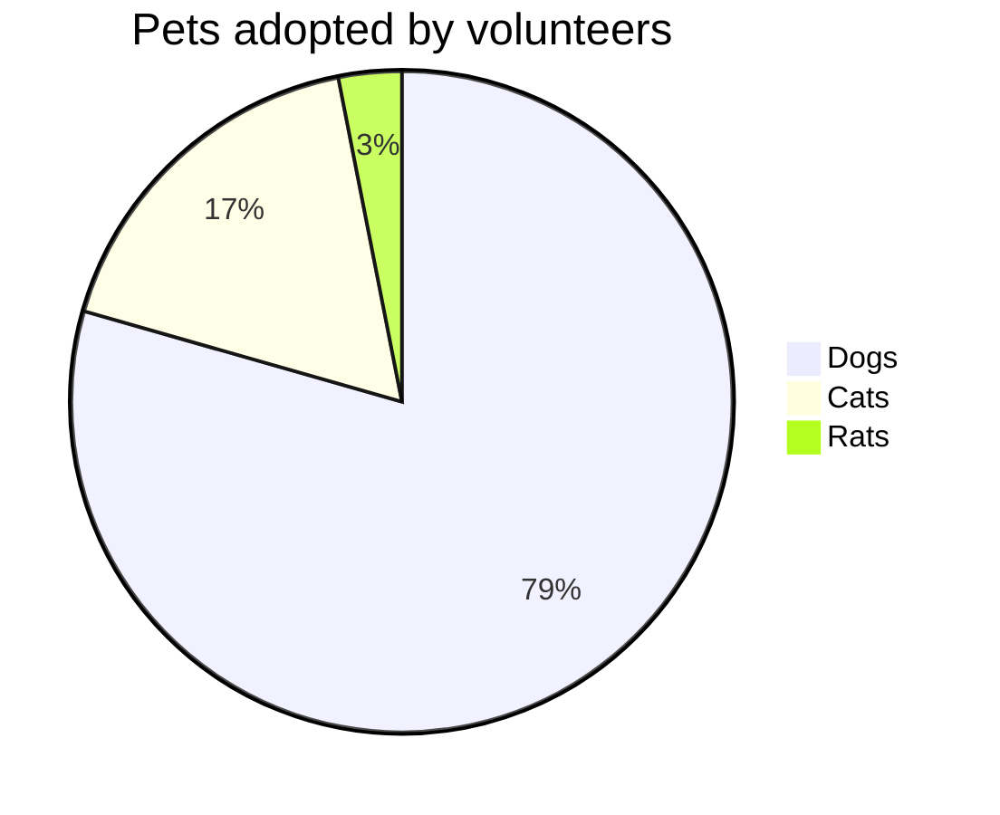
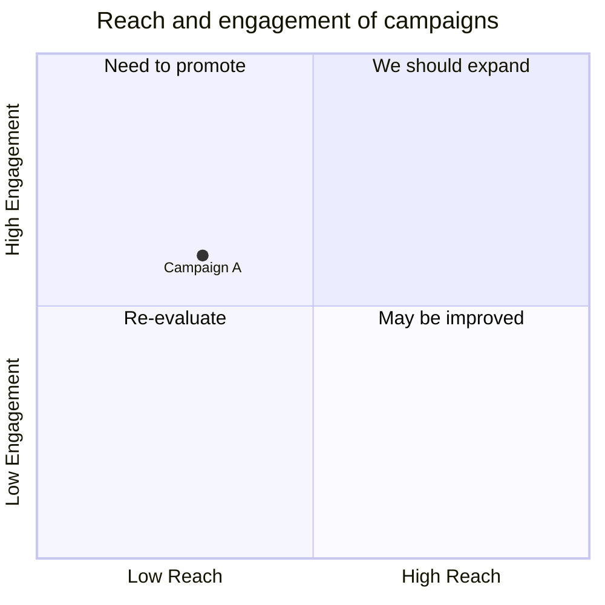
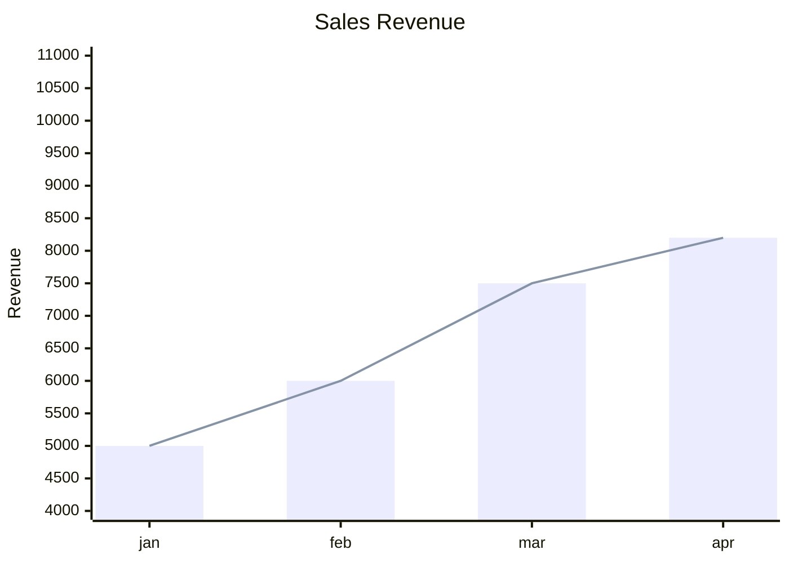
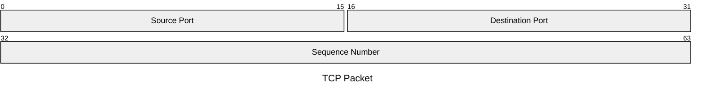

# Charts and Comparison Diagrams

Pie, Quadrant, XY Chart, and Packet diagrams visualize numeric data, prioritization, or binary layout rather than process or structure.

## Pie Chart

**When to use:** proportions of a whole across a small number of categories.

````markdown

````

Each line is `"label" : value` (value must be a positive number; slices are ordered clockwise as listed). Optional `showData` (after `pie`) prints the raw value next to each legend entry. Set `donutHole` via config to render as a donut instead of a full pie.

## Quadrant Chart

**When to use:** plotting items across two axes to prioritize or categorize them — e.g. an Eisenhower urgent/important matrix, or a reach-vs-engagement chart.

````markdown

````

`x-axis`/`y-axis` set axis labels (left/right, bottom/top); `quadrant-1..4` label each quadrant (1 = top-right, going counter-clockwise). Each point is `Name: [x, y]` with `x`/`y` in `0`–`1`.

## XY Chart

**When to use:** plotting numeric bar and/or line series across two axes — the general-purpose bar/line chart when pie/quadrant don't fit.

````markdown

````

`x-axis` takes either a category list `[a, b, c]` or a numeric range `title min --> max`. `y-axis title min --> max` sets the numeric range (auto-computed from data if omitted). `bar [...]` and `line [...]` each take a numeric array; add `xychart horizontal` (before other statements) to flip orientation.

## Packet Diagram

**When to use:** the byte/bit layout of a network packet, file header, or any binary format — useful for protocol or wire-format documentation.

````markdown

````

Each line is `<start>-<end>: "label"` (bit positions, inclusive) or `+<count>: "label"` to auto-advance from the previous field's end by `<count>` bits — mixing both forms in the same diagram is fine.
