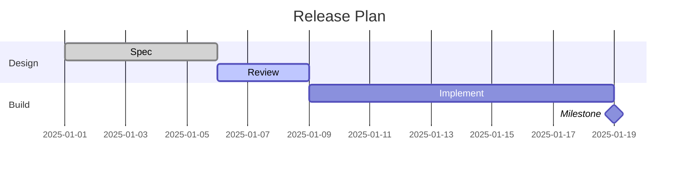
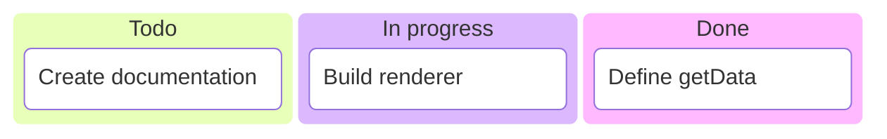
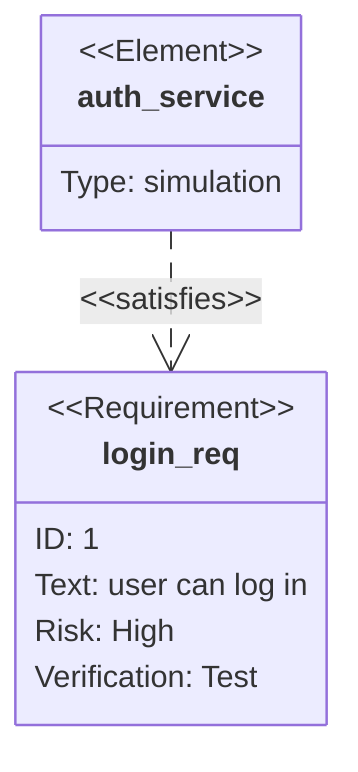

# Planning and Tracking Diagrams

Gantt, Kanban, and Requirement diagrams document project execution and formal traceability rather than code structure or runtime behavior.

## Gantt Chart

**When to use:** a project schedule — task durations, dependencies, and milestones over calendar time.

````markdown

````

Each task line is `Name : [tags,] [id,] <start>, <end-or-duration>`. Optional tags `done`, `active`, `crit`, `milestone` (first, if present) control rendering. `after <taskId>` chains a task off another's end instead of an explicit date. `section <name>` groups rows; `excludes weekends` (or specific dates) skips non-working days when computing durations.

## Kanban Diagram

**When to use:** a task board with columns (Todo/In Progress/Done) — lighter-weight than Gantt, no dates or dependencies.

````markdown

````

A column is `columnId[Column Title]` (or a bare title, auto-generating an id); indented lines below it are tasks: `taskId[Task description]`. Attach metadata with `@{ assigned: 'name', ticket: 'ABC-1', priority: 'High' }` after a task — `priority` accepts `'Very High' | 'High' | 'Low' | 'Very Low'`.

## Requirement Diagram

**When to use:** formal SysML-style traceability — linking requirements to the elements (tests, components, docs) that satisfy or verify them.

````markdown

````

`requirement <name> { id: ... text: ... risk: <Low|Medium|High> verifymethod: <Analysis|Inspection|Test|Demonstration> }` defines a requirement; `requirement` can be swapped for `functionalRequirement`, `interfaceRequirement`, `performanceRequirement`, `physicalRequirement`, or `designConstraint`. `element <name> { type: ... docref: ... }` defines a connected artifact. Relationships: `<source> - <type> -> <destination>` where `<type>` is one of `contains`, `copies`, `derives`, `satisfies`, `verifies`, `refines`, `traces`.
