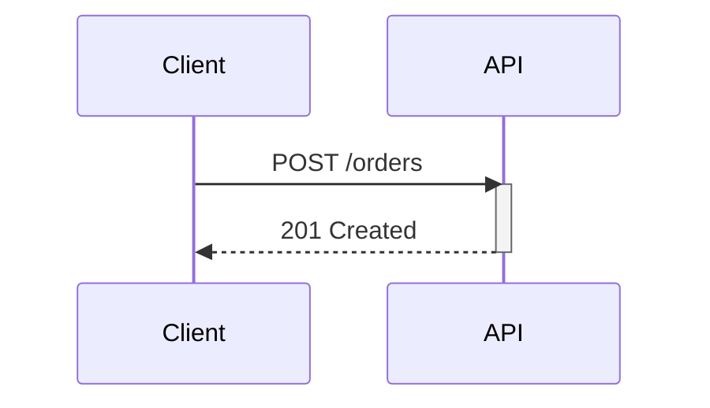
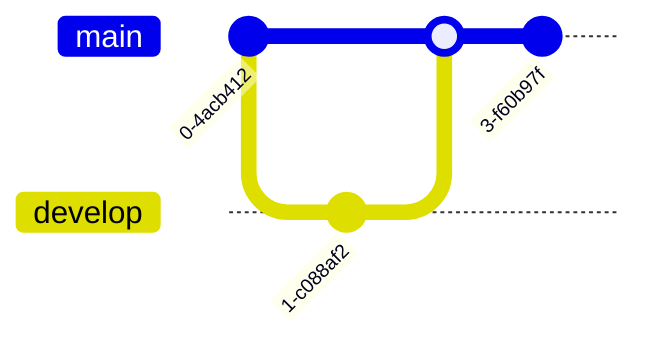
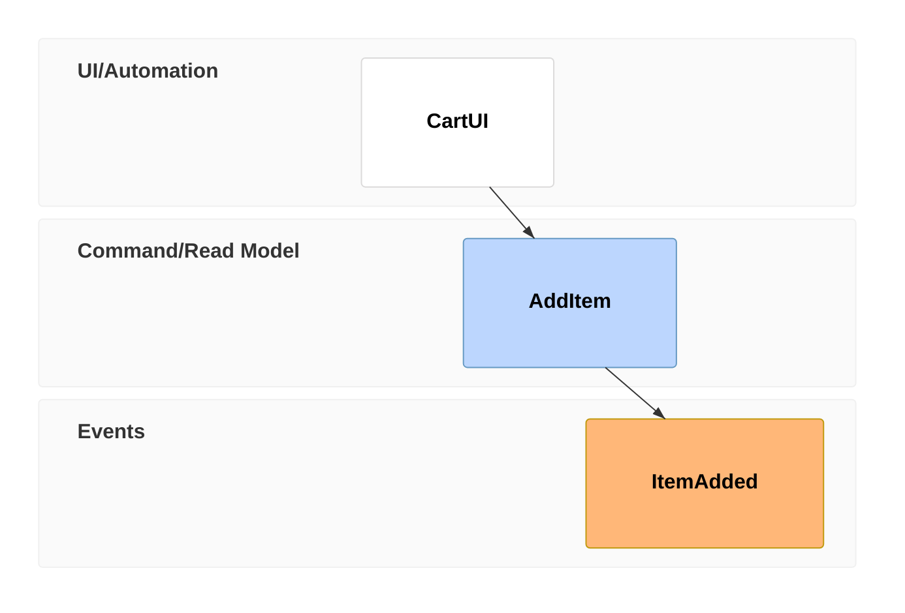
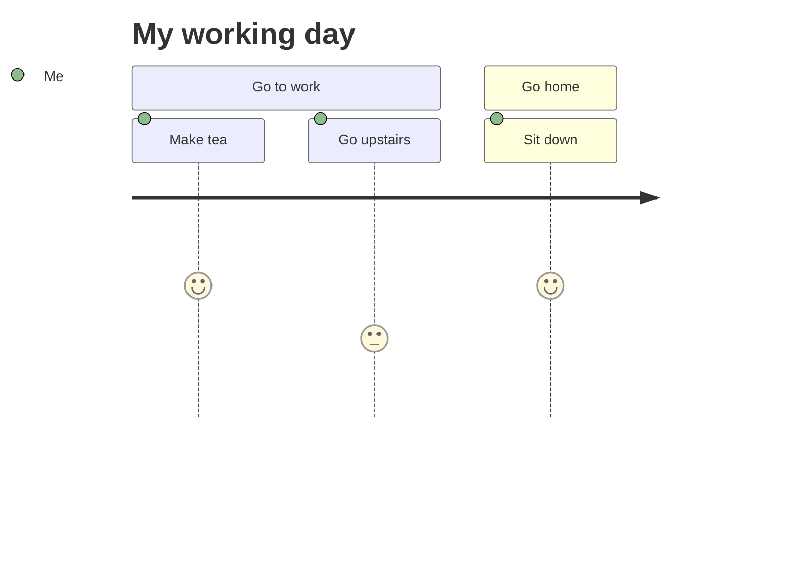

# Process and Time Diagrams

Sequence, GitGraph, Event Modeling, and User Journey diagrams document what happens *over time* — messages, commits, or steps in order — rather than static structure.

## Sequence Diagram

**When to use:** ordered messages or calls between actors/systems — API calls, protocol exchanges, or any "who calls whom, in what order" interaction.

````markdown

````

| Arrow | Meaning |
| --- | --- |
| `->>` | Solid line, arrowhead (sync call) |
| `-->>` | Dotted line, arrowhead (response/async) |
| `-)` | Solid, open arrow (fire-and-forget) |
| `-x` | Solid, cross end (message that fails/is dropped) |

`activate`/`deactivate` (or `+`/`-` suffix on the arrow) show a lifeline is busy. `loop ... end`, `alt ... else ... end`, `opt ... end`, and `par ... and ... end` express iteration, branching, optional steps, and parallel actions respectively. `Note over A,B: text` attaches a note spanning participants.

## GitGraph (Git) Diagram

**When to use:** visualizing a branch/commit/merge history — explaining a branching strategy or a specific incident's commit graph.

````markdown

````

Every graph starts on `main`. `branch <name>` creates and switches to a branch; `checkout <name>` switches without creating; `merge <name>` merges that branch into the current one. `commit id: "label" tag: "v1.0"` names/tags a commit; `type: REVERSE` or `type: HIGHLIGHT` changes a commit's rendering.

## Event Modeling Diagram

**When to use:** documenting an event-sourced or CQRS system as a UI/Command/Event timeline — how a user action becomes a command, which produces an event, which updates a read model.

````markdown

````

Each `tf <n> <type> <Name>` line is a Time Frame; `<n>` is a unique reference number (order in the file doesn't matter, only uniqueness). `<type>` is one of `ui`/`pcr` (processor), `cmd`, `rmo` (read model), or `evt` — each type maps to a fixed swimlane (UI/Automation, Command/Read Model, Events). Use the `rf` (reset frame) token to break automatic inference when a flow needs to restart from an external event.

## User Journey Diagram

**When to use:** showing a user's steps across a task and how satisfying each step is — UX/product documentation of an end-to-end flow.

````markdown

````

Group steps with `section <name>`. Each task line is `Task name: <score 1-5>: <comma-separated actors>` — the score (1 lowest, 5 highest) drives the plotted satisfaction line.
