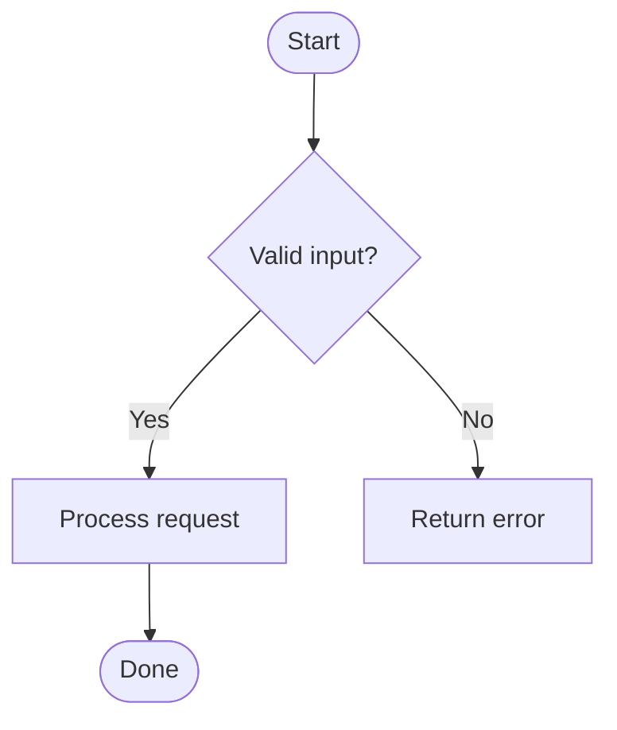
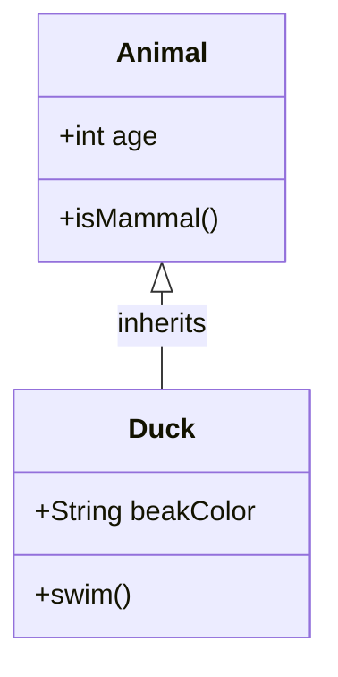
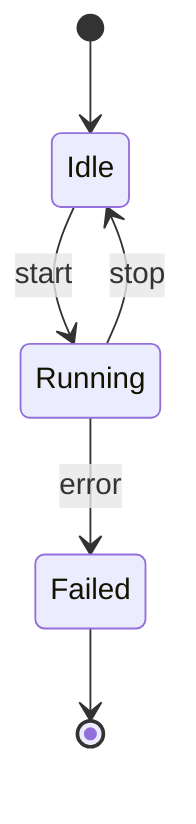
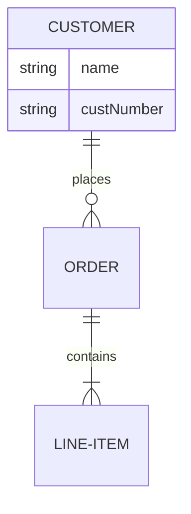
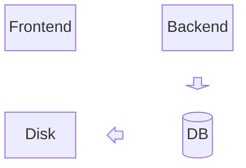

# Structure and Data Diagrams

Flowchart, Class, State, Entity Relationship, and Block diagrams document what a system *is* — its logic, shape, or schema — rather than what happens over time.

## Flowchart

**When to use:** branching logic, a process, a decision tree, or any directed graph of steps.

````markdown

````

| Syntax | Meaning |
| --- | --- |
| `flowchart TD` / `LR` / `BT` / `RL` | Direction: top-down, left-right, bottom-up, right-left |
| `id[Text]` | Rectangle (process) |
| `id(Text)` | Rounded rectangle |
| `id([Text])` | Stadium (start/end) |
| `id{Text}` | Rhombus (decision) |
| `id((Text))` | Circle |
| `A --> B` | Arrow; `A -->\|label\| B` adds a label |
| `A -.-> B` | Dotted arrow; `A ==> B` thick arrow |
| `subgraph Name ... end` | Group nodes visually |

Gotchas: the bare word `end` (all lowercase) breaks parsing — capitalize it (`End`) if used as a node label. A node id starting with `o` or `x` right before `--` can be misread as a circle/cross edge — add a space or capitalize.

## Class Diagram

**When to use:** modeling object-oriented structure — classes, attributes, methods, and how classes relate.

````markdown

````

| Relation | Meaning |
| --- | --- |
| `A <\|-- B` | Inheritance (B inherits from A) |
| `A *-- B` | Composition |
| `A o-- B` | Aggregation |
| `A --> B` | Association |
| `A ..> B` | Dependency |
| `A ..\|> B` | Realization (interface implementation) |

Members use `+`/`-`/`#`/`~` for public/private/protected/package visibility; a trailing `()` marks a method vs. an attribute. Use `class Name { ... }` to group members, or `class Name` on its own line then `Name : member` per line.

## State Diagram

**When to use:** modeling the states of a single entity (order, connection, UI component) and its transitions — not multiple actors.

````markdown

````

`[*]` marks the start/end pseudostate. Use `state Name { ... }` for a composite (nested) state, and `<<choice>>` / `<<fork>>` / `<<join>>` for branching logic inside the diagram. Use `direction LR` (etc.) to change orientation.

## Entity Relationship Diagram

**When to use:** modeling database entities, their attributes, and cardinality of relationships — logical or physical data models.

````markdown

````

Cardinality markers go on both ends: `|o` zero-or-one, `||` exactly one, `}o` zero-or-more, `}|` one-or-more. `--` = identifying (solid line), `..` = non-identifying (dashed line). Attribute blocks (`ENTITY { type name }`) support key annotations `PK`/`FK`/`UK` after the name.

## Block Diagram

**When to use:** a freeform architecture or system diagram where you need explicit control over node position (Mermaid's flowchart auto-layout can misplace shapes); good for network/software architecture sketches.

````markdown

````

`columns N` sets a grid width; blocks fill left-to-right, wrapping to new rows. `space` (or `space:N`) reserves empty grid cells for layout. `block:id ... end` nests a composite block. Node shapes reuse flowchart shape syntax (`[Text]`, `(Text)`, `((Text))`, `[(Text)]` for cylinder/database, etc.).
