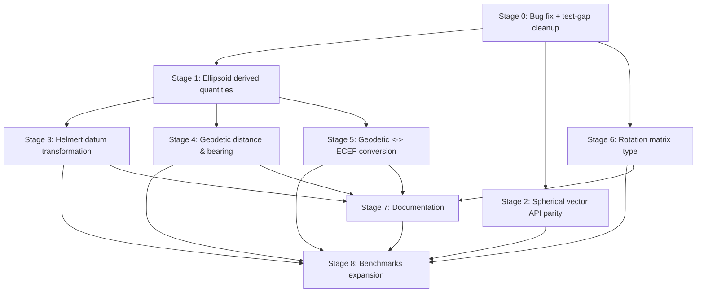

# NetFabric.Numerics — Completion Plan

This document is the result of a full research pass over the repository: every
project under `src/`, every unit test folder, the `docs/` site, and the
`.agents/skills/` domain-knowledge library already checked into the repo. It
records the usage patterns the codebase already follows, the concrete gaps and
issues found, and a staged plan to close them using the `nf-dev` squad
(`NF Dev Orchestrator` and its subagents).

## How to use this plan

Each stage below is self-contained and ends with a **Squad prompt** — paste
that text as-is into a request to `NF Dev Orchestrator` (or say "run stage N
of IMPLEMENTATION_PLAN.md"). The orchestrator dispatches `nf-dev-planner`,
`nf-dev-implementer`, `nf-dev-quality-gate`, and `nf-dev-review-orchestrator`
for that one request; you do not need to break the stage down further.

Recommended order: stages are numbered by dependency, not just priority.
Stage 0 must run first (it fixes a live bug and closes test gaps that later
stages should not inherit). Stages 1–3 are independent of each other and can
run in any order, or in parallel conversations, once Stage 0 is merged.
Stages 3–5 depend on Stage 1 (ellipsoid math). Stage 6 depends on nothing but
is best done after Stage 0's test-gap cleanup so its own new tests follow the
refreshed conventions. Stages 7–8 should run last since they document/
benchmark features added by the earlier stages.



Iterate: after each stage's review is approved, re-read this file — some
later-stage prompts reference types created by earlier stages, so keep the
plan open while dispatching.

## Research summary — usage patterns already established

These conventions recur across every mature part of the codebase and must be
followed by all new work:

| Pattern | Where it's used | Rule for new code |
| --- | --- | --- |
| Generic math over `T : struct, IFloatingPoint<T>, IMinMaxValue<T>` (or `INumber<T>`) | Every `Point`/`Vector`/`Angle`/`Ellipsoid` type | Never hardcode `double`/`float`; always parameterize `T` and use `T`'s static abstract members |
| `CreateChecked<TOther>` / `CreateSaturating<TOther>` / `CreateTruncating<TOther>` triplet | Every value type (`Point`, `Vector`, `Quaternion`, `Ellipsoid`, `Angle`) | Any new value type needs all three conversion methods |
| `Zero` / `MinValue` / `MaxValue` static fields + explicit interface `IMinMaxValue<TSelf>` forwarding | Every value type | Follow the same `#region constants` block shape |
| `IGeometricBase` / `IPoint<TSelf, TCoordinateSystem>` / `IVector<TSelf, TCoordinateSystem, T>` interface layering | `Rectangular2D`, `Rectangular3D`, `Polar`, `Spherical` | Any new coordinate system implements the same interface stack |
| Coordinate-system-specific static partial `Point`/`Vector` classes holding free functions (`Dot`, `Cross`, `Normalize`, `Lerp`, `Clamp`, `AngleBetween`) alongside the `readonly record struct` holding operators | All four coordinate systems | Put instance algebra on the struct, "verb" operations on the static partial class |
| `VectorSum.cs` / `VectorAverage.cs` / `VectorSpanOperations.cs` per coordinate system, built on `NetFabric.Numerics.Tensors` (`Tensor.Add`, etc. via `MemoryMarshal.Cast`) | `Rectangular2D`, `Rectangular3D`, `Polar` | Same three files, same `Tensor.*` delegation, for every coordinate system that has a `Vector` type |
| `[SkipLocalsInit]` + `[System.Diagnostics.DebuggerDisplay]` on every value struct | All `Point`/`Vector`/`Quaternion` types | Apply both attributes to new structs |
| Datum/ellipsoid types as `static abstract` interface implementations (`WGS84<T> : IDatum<T>`) selected via generic parameter (`Point<TDatum, TAngleUnits, T>`) | `NetFabric.Numerics.Geodesy` | New datums/ellipsoids follow the same static-abstract-interface shape, no runtime dispatch |
| `[Theory]` + `[InlineData]`/`[MemberData]` over multiple `[Fact]`s, FluentAssertions `.Should()` | All `*.UnitTests` projects | Match this style for new tests |
| One `AGENTS.md` per project documenting its "Key patterns" table | `NetFabric.Numerics`, `.Angle`, `.Geodesy` | Update the relevant `AGENTS.md` whenever a stage adds a new pattern worth documenting |

## Gaps and issues found

### Confirmed bug

1. **`Geodetic3.Point<TDatum, TAngleUnits, T>.MaxValue` has the wrong `Height`.**
   [src/NetFabric.Numerics.Geodesy/Geodetic3/Point.cs](src/NetFabric.Numerics.Geodesy/Geodetic3/Point.cs)
   constructs `MaxValue` with `T.MinValue` for the height component (copy-paste
   from `MinValue` two lines above) instead of `T.MaxValue`:

   ```csharp
   public static readonly Point<TDatum, TAngleUnits, T> MaxValue
       = new(Angle<TAngleUnits, T>.Right, Angle<TAngleUnits, T>.Straight, T.MinValue);
   ```

   This makes `MaxValue.Height < MinValue.Height`, breaking `IMinMaxValue`
   semantics and any code that clamps/compares against it. No test caught it
   because Geodetic3 has zero test coverage (see below).

### Test coverage gaps

2. **`NetFabric.Numerics.Geodesy.UnitTests` has no `Geodetic3` tests at all** —
   only `Geodetic2/PointTests.cs` exists. The entire 3D geodetic point type
   (including the `MaxValue` bug above) is untested.
3. **`Rectangular3D` tests are missing vector-type and span tests** that
   `Rectangular2D` has: no `VectorDoubleTests`/`VectorFloatTests`/
   `VectorIntTests`, no `SpanAddTests`.
4. **`Spherical` tests are missing almost everything** — only `PointTests.cs`
   exists; no vector tests, no `SumTests`, no `SpanAddTests` (consistent with
   gap 6 below: the production code for those doesn't exist either).
5. **`Polar` tests are missing dedicated numeric-type vector tests**
   (`VectorDoubleTests`/`VectorFloatTests`/`VectorIntTests`) that
   `Rectangular2D` has.

### Missing production API surface

6. **`Spherical` package lacks `VectorSum.cs`, `VectorAverage.cs`, and
   `VectorSpanOperations.cs`.** `Rectangular2D`, `Rectangular3D`, and `Polar`
   all have these three files; `Spherical/` only has `CoordinateSystem.cs`,
   `Point.cs`, `PointReduced.cs`, and `Vector.cs`. This is a plain API-surface
   inconsistency across coordinate systems.
7. **`IMatrix<TSelf, T>`** ([src/NetFabric.Numerics/IMatrix.cs](src/NetFabric.Numerics/IMatrix.cs))
   **has zero implementations anywhere in the repo.** The interface (row/column
   count, indexer, `Identity`) is fully designed but no `Matrix3x3<T>` /
   `Matrix4x4<T>` struct exists, even though `Quaternion<T>` already supports
   rotating vectors, `Slerp`/`Lerp`, and conversion to/from axis-angle — a
   rotation-matrix type is the natural complement and is pure dead
   surface area until implemented.
8. **`Offset<T>` stores 7 Helmert transformation parameters
   (`XYZOffset`, `RX`, `RY`, `RZ`, `SC`) that are never applied anywhere.**
   Every `IDatum<T>` (`WGS84`, `WGS1972`, `NAD83`, `NAD1927CONUS`) exposes an
   `Offset`, but there is no method to actually transform a `Geodetic2`/
   `Geodetic3` point from one datum to another using it. This is the
   headline feature implied by having multiple datums at all, and it's
   entirely unimplemented. (The `.agents/skills/helmert-datum-transformation/`
   skill already documents the math for this — it appears to have been
   prepared in anticipation of this exact gap.)
9. **`Ellipsoid<T>` only stores `EquatorialRadius` and `Flattening`** — no
   derived quantities (eccentricity, semi-minor axis, radii of curvature in
   the meridian/prime vertical, mean radius, surface area, volume), even
   though the `.agents/skills/reference-ellipsoids/` skill documents exactly
   these formulas.
10. **No geodetic distance or bearing calculation.** There is no
    haversine/Vincenty great-circle distance and no initial/final bearing
    between two `Geodetic2`/`Geodetic3` points — a baseline feature users
    would expect from a geodesy package.
11. **No `Geodetic3` ↔ `Rectangular3D` (ECEF) conversion.** `Rectangular2D`
    has `ToPolar`, `Rectangular3D` has `ToSpherical`, `Polar`/`Spherical` have
    `ToRectangular` — but `Geodesy` has no analogous conversion to/from
    earth-centered-earth-fixed Cartesian coordinates, which is required
    before any cross-datum or cross-coordinate-system geodetic math is
    possible.

### Documentation gaps

12. **`docs/articles/` has no Geodesy article** despite
    `NetFabric.Numerics.Geodesy` being a fully shipped, versioned package —
    only `Angles.md`, `GenericMath.md`, and `PointsAndVectors.md` exist, and
    `toc.yml` doesn't reference geodesy at all.
13. **No article covering `Quaternion<T>`/3D rotation**, despite it being a
    fully implemented feature (multiplication, `Slerp`, `Lerp`, axis-angle
    construction, normalization).

### Benchmark gaps

14. **`NetFabric.Numerics.Benchmarks` only covers `Angle` sum/reduce and
    `Rectangular2D` addition/indexing.** There are no benchmarks for `Polar`,
    `Spherical`, `Rectangular3D`/`Quaternion`, or `Geodesy` — all of which are
    performance-sensitive generic-math code per this repo's stated design
    goals.

## Stage 0 — Fix the `Geodetic3.MaxValue` bug and close test-coverage gaps

Fixes gap 1 and gaps 2–5. No new production API — safe to run first and in
isolation.

**Acceptance criteria**

- `Geodetic3.Point<TDatum, TAngleUnits, T>.MaxValue.Height` equals `T.MaxValue`.
- `NetFabric.Numerics.Geodesy.UnitTests` gets a `Geodetic3/PointTests.cs`
  mirroring `Geodetic2/PointTests.cs` (construction validation, `Zero`,
  `MinValue`/`MaxValue`, `CreateChecked`/`CreateSaturating`/`CreateTruncating`),
  including a regression test asserting `MaxValue.Height == T.MaxValue`.
- `Rectangular3D.UnitTests` gets `VectorDoubleTests.cs`, `VectorFloatTests.cs`,
  `VectorIntTests.cs`, and `SpanAddTests.cs` mirroring the `Rectangular2D`
  equivalents.
- `Spherical.UnitTests` gets `SumTests.cs` and vector construction/algebra
  tests mirroring `Polar`'s test set (adjusted for the extra `Polar` angle
  component).
- `Polar.UnitTests` gets `VectorDoubleTests.cs`, `VectorFloatTests.cs`,
  `VectorIntTests.cs` mirroring `Rectangular2D`'s.
- `dotnet test -c Release` passes for all four `*.UnitTests` projects.

**Squad prompt**

```text
In NetFabric.Numerics, fix a bug and close test-coverage gaps:

1. Bug fix: src/NetFabric.Numerics.Geodesy/Geodetic3/Point.cs defines
   `MaxValue` with `T.MinValue` as the Height component instead of
   `T.MaxValue` (copy-paste error from the MinValue field above it). Fix it
   so MaxValue.Height is T.MaxValue.

2. Add src/NetFabric.Numerics.Geodesy.UnitTests/Geodetic3/PointTests.cs,
   mirroring the existing Geodetic2/PointTests.cs test shape (construction
   validation for Latitude/Longitude range, Zero, MinValue/MaxValue,
   CreateChecked/CreateSaturating/CreateTruncating), plus a Height
   dimension, and include an explicit regression test asserting
   MaxValue.Height equals T.MaxValue (not T.MinValue) so the bug above
   cannot regress.

3. Add src/NetFabric.Numerics.UnitTests/Rectangular3D/VectorDoubleTests.cs,
   VectorFloatTests.cs, VectorIntTests.cs, and SpanAddTests.cs, mirroring the
   equivalent files in src/NetFabric.Numerics.UnitTests/Rectangular2D/ for
   the 3D Vector<T> type (add the Z dimension throughout).

4. Add vector algebra/sum tests to src/NetFabric.Numerics.UnitTests/Spherical/
   mirroring the equivalent tests in src/NetFabric.Numerics.UnitTests/Polar/
   (SumTests.cs plus construction/operator coverage for Spherical's
   Vector<TAngleUnits, T>), adapted for the extra Polar angle component.

5. Add src/NetFabric.Numerics.UnitTests/Polar/VectorDoubleTests.cs,
   VectorFloatTests.cs, VectorIntTests.cs mirroring the equivalent files in
   Rectangular2D, adapted for Polar's Vector<TAngleUnits, T> shape (radius +
   azimuth angle instead of X/Y).

Follow this repo's existing test conventions (xUnit [Theory]/[InlineData],
FluentAssertions .Should()) as documented in AGENTS.md and the per-project
AGENTS.md files. Run dotnet test -c Release for every affected test project
and ensure everything passes.
```

## Stage 1 — Ellipsoid derived quantities

Closes gap 9. Read the `reference-ellipsoids` skill
(`.agents/skills/reference-ellipsoids/SKILL.md`) before implementing — it has
the exact formulas to use.

**Acceptance criteria**

- `Ellipsoid<T>` (or a new static partial `Ellipsoid` class following the
  `Point`/`Vector` pattern) exposes: semi-minor axis (`PolarRadius`), first
  eccentricity squared, second eccentricity squared, mean radius, radius of
  curvature in the meridian at a given latitude, radius of curvature in the
  prime vertical at a given latitude, surface area, and volume.
- All new members are generic over `T` using `T`'s static abstract math
  members (`T.Sqrt`, `T.Pow`, etc.) — no `Math`/`MathF`.
- XML docs on every new public member (required per root `AGENTS.md`).
- Unit tests in `NetFabric.Numerics.Geodesy.UnitTests` covering each new
  member against known reference values for `Ellipsoid<T>.WGS1984` (e.g.
  semi-minor axis ≈ 6356752.314245, first eccentricity² ≈ 0.00669437999014).

**Squad prompt**

```text
In NetFabric.Numerics.Geodesy, extend Ellipsoid<T>
(src/NetFabric.Numerics.Geodesy/Ellipsoid.cs) with derived reference-ellipsoid
quantities. Read .agents/skills/reference-ellipsoids/SKILL.md first for the
exact formulas and terminology, then add these computed members (as
properties or static partial-class methods, matching the existing
Point/Vector "verb methods on a static partial class" pattern used elsewhere
in this repo):

- Semi-minor axis (polar radius) from EquatorialRadius and Flattening.
- First eccentricity squared and second eccentricity squared.
- Arithmetic mean radius.
- Radius of curvature in the meridian at a given geodetic latitude.
- Radius of curvature in the prime vertical at a given geodetic latitude.
- Ellipsoid surface area.
- Ellipsoid volume.

Constrain T the same way Ellipsoid<T> already does
(struct, IFloatingPoint<T>, plus IRootFunctions<T>/IPowerFunctions<T> as
needed) and implement every formula using T's static abstract members
(T.Sqrt, T.Pow, etc.) — never Math/MathF. Add XML docs to every new public
member.

Add unit tests in NetFabric.Numerics.Geodesy.UnitTests validating each new
member against known reference values for Ellipsoid<double>.WGS1984 (semi-minor
axis ~= 6356752.314245, first eccentricity squared ~= 0.00669437999014, second
eccentricity squared ~= 0.00673949674228). Use FluentAssertions
.Should().BeApproximately(...) with a reasonable tolerance. Run dotnet test
-c Release for NetFabric.Numerics.Geodesy.UnitTests and ensure it passes.
```

## Stage 2 — Spherical vector API parity (Sum/Average/Span operations)

Closes gap 6.

**Acceptance criteria**

- `src/NetFabric.Numerics/Spherical/VectorSum.cs`,
  `VectorAverage.cs`, and `VectorSpanOperations.cs` exist, matching the
  structure and `Tensor.*` delegation pattern used in
  `src/NetFabric.Numerics/Polar/VectorSum.cs`,
  `VectorAverage.cs`, and `VectorSpanOperations.cs` (adjusted for
  Spherical's extra `Polar` angle component).
- Unit tests added for `Sum`/`Average`/span add operations on
  `Spherical.Vector<TAngleUnits, T>` (this may already be partly covered by
  Stage 0's test additions — check before duplicating).
- `dotnet test -c Release` passes for `NetFabric.Numerics.UnitTests`.

**Squad prompt**

```text
In NetFabric.Numerics, close an API-surface inconsistency: the Spherical
coordinate system is missing VectorSum.cs, VectorAverage.cs, and
VectorSpanOperations.cs, which every other coordinate system
(Rectangular2D, Rectangular3D, Polar) already has.

Add src/NetFabric.Numerics/Spherical/VectorSum.cs,
src/NetFabric.Numerics/Spherical/VectorAverage.cs, and
src/NetFabric.Numerics/Spherical/VectorSpanOperations.cs, mirroring the
existing src/NetFabric.Numerics/Polar/VectorSum.cs, VectorAverage.cs, and
VectorSpanOperations.cs files exactly in structure and in their use of
NetFabric.Numerics.Tensors (Tensor.Add/Subtract/Multiply/Divide via
MemoryMarshal.Cast), but adapted for Spherical.Vector<TAngleUnits, T>'s three
components (Radius, Azimuth, Polar) instead of Polar's two (Radius, Azimuth).

Add unit tests in src/NetFabric.Numerics.UnitTests/Spherical/ covering Sum,
Average, and span Add/Subtract/Multiply/Divide operations for
Spherical.Vector<TAngleUnits, T>, following the equivalent Polar test files'
shape. If Stage 0 of IMPLEMENTATION_PLAN.md already added overlapping
Spherical vector tests, extend rather than duplicate them. Run dotnet test
-c Release for NetFabric.Numerics.UnitTests and ensure it passes.
```

## Stage 3 — Helmert datum transformation

Closes gap 8. Depends on Stage 1 only for consistency of style, not for
compilation — can run in parallel with Stage 1 if preferred, but review the
`reference-ellipsoids` skill output first since transformations often need
ellipsoid height handling. Read
`.agents/skills/helmert-datum-transformation/SKILL.md` before implementing.

**Acceptance criteria**

- A method exists to transform a `Geodetic3.Point<TDatumFrom, TAngleUnits, T>`
  into `Geodetic3.Point<TDatumTo, TAngleUnits, T>` using the source datum's
  `Offset<T>` (7-parameter Helmert transformation: 3 translations, 3
  rotations, 1 scale), going through geocentric (ECEF) Cartesian coordinates
  as an intermediate representation.
- The transformation is generic over `T` and both datum type parameters,
  following the existing `IDatum<T>`/static-abstract-interface pattern (no
  runtime type checks/casts).
- XML docs explain the direction of the transformation and reference the
  `Offset<T>` fields used.
- Unit tests transform a known WGS84 point to/from another supported datum
  (e.g. `NAD83` or `WGS1972`) and check the result is within an acceptable
  tolerance of an independently-known reference value, plus a round-trip test
  (`WGS84 -> X -> WGS84` returns approximately the original point).

**Squad prompt**

```text
In NetFabric.Numerics.Geodesy, implement the 7-parameter Helmert datum
transformation that Offset<T> (src/NetFabric.Numerics.Geodesy/Offset.cs) was
designed for but never had an implementation using it. Read
.agents/skills/helmert-datum-transformation/SKILL.md first for the exact
math (3 translations, 3 rotations, 1 scale parameter, linearized vs. full
rotation matrix form) and .agents/skills/geodetic-coordinate-bounds/SKILL.md
for coordinate validity constraints.

Add a way to transform a Geodetic3.Point<TDatumFrom, TAngleUnits, T> into a
Geodetic3.Point<TDatumTo, TAngleUnits, T> (e.g. a static method on
Geodetic3.Point, or a static partial-class method following this repo's
existing "verb methods on a static partial class" pattern) that:

1. Converts the source point to geocentric (ECEF) Cartesian coordinates
   using TDatumFrom's Ellipsoid.
2. Applies the 7-parameter Helmert transformation using TDatumFrom's Offset
   (XYZOffset translation, RX/RY/RZ rotations, SC scale).
3. Converts the result back to geodetic coordinates using TDatumTo's
   Ellipsoid.

Constrain TDatumFrom/TDatumTo the same way Geodetic3.Point already does
(IDatum<T>) and implement all math using T's static abstract members, never
Math/MathF. Add XML docs explaining the transformation direction and the
Offset fields consumed.

If Stage 5 of IMPLEMENTATION_PLAN.md (Geodetic <-> ECEF conversion) has
already been implemented, reuse its conversion methods instead of
duplicating the geodetic-to-ECEF math; otherwise implement the minimal ECEF
conversion needed here and note in a comment that Stage 5 should consolidate
it.

Add unit tests in NetFabric.Numerics.Geodesy.UnitTests that: (a) transform a
known WGS84 point to another supported datum (WGS1972, NAD83, or
NAD1927CONUS) and assert the result is within a reasonable tolerance of an
independently verifiable reference value, and (b) round-trip a point
(WGS84 -> other datum -> WGS84) and assert it returns approximately the
original coordinates. Run dotnet test -c Release for
NetFabric.Numerics.Geodesy.UnitTests and ensure it passes.
```

## Stage 4 — Geodetic distance and bearing

Closes gap 10. Independent of Stage 3, but reuses Stage 1's ellipsoid math if
already merged.

**Acceptance criteria**

- Haversine great-circle distance between two `Geodetic2`/`Geodetic3` points
  sharing the same datum.
- Initial and final bearing (as `Angle<TAngleUnits, T>`) between two points.
- Optionally, a more precise Vincenty distance/bearing using the ellipsoid's
  flattening (note as a follow-up if not included in this stage — do not
  block on it).
- Unit tests against known distances (e.g. two well-known city coordinate
  pairs with published great-circle distances) within a documented tolerance.

**Squad prompt**

```text
In NetFabric.Numerics.Geodesy, add great-circle distance and bearing
calculations between two geodetic points sharing the same datum. Read
.agents/skills/trigonometric-functions/SKILL.md and
.agents/skills/angles-and-circular-arithmetic/SKILL.md first for domain
conventions on trig and angle handling used elsewhere in this repo.

Add (as static partial-class "verb" methods, matching this repo's existing
Point/Vector pattern):

1. Haversine great-circle distance between two Geodetic2.Point<TDatum,
   TAngleUnits, T> (or Geodetic3, ignoring height) sharing the same TDatum,
   returning distance in the same unit as the datum's Ellipsoid
   EquatorialRadius.
2. Initial bearing and final bearing between two such points, returned as
   Angle<TAngleUnits, T>.

Constrain T and implement using T's static abstract math members (T.Sin,
T.Cos, T.Atan2, T.Sqrt, etc. via the existing Angle trigonometry helpers in
NetFabric.Numerics.Angle where applicable) — never Math/MathF. Add XML docs
to every new public member.

Add unit tests in NetFabric.Numerics.Geodesy.UnitTests validating distance
and bearing against at least two well-known, independently verifiable
coordinate pairs (e.g. published great-circle distances between major
cities), asserting results within a documented tolerance using
FluentAssertions .Should().BeApproximately(...). Run dotnet test -c Release
for NetFabric.Numerics.Geodesy.UnitTests and ensure it passes.
```

## Stage 5 — Geodetic ↔ ECEF (Rectangular3D) conversion

Closes gap 11. If Stage 3 already implemented an inline ECEF conversion,
this stage should consolidate/refactor to a single shared implementation
rather than keeping two.

**Acceptance criteria**

- `Geodetic3.Point<TDatum, TAngleUnits, T>` converts to and from
  `Rectangular3D.Point<T>` (ECEF Cartesian), using the datum's `Ellipsoid<T>`.
- Follows the existing `ToRectangular`/`ToSpherical`/`ToPolar` naming and
  placement convention (static method on the source type's static partial
  class).
- If Stage 3 already has an inline ECEF conversion, refactor it to call this
  new shared method instead of duplicating the math.
- Unit tests for round-trip conversion (`Geodetic3 -> ECEF -> Geodetic3`)
  and at least one known reference point (e.g. the WGS84 origin or a
  published lat/lon/height → ECEF example).

**Squad prompt**

```text
In NetFabric.Numerics.Geodesy, add conversion between Geodetic3.Point<TDatum,
TAngleUnits, T> and Rectangular3D.Point<T> (earth-centered-earth-fixed / ECEF
Cartesian coordinates), following the same naming and placement convention
as the existing Rectangular2D.Point.ToPolar, Rectangular3D.Point.ToSpherical,
and Spherical.Point.ToRectangular static conversion methods elsewhere in this
repo.

Use the datum's Ellipsoid<T> (equatorial radius, flattening/eccentricity) to
perform the standard geodetic-to-ECEF and ECEF-to-geodetic conversions. If
NetFabric.Numerics.Geodesy.UnitTests or the Stage 3 Helmert transformation
work (if already merged) contains an inline version of this same math,
refactor both to share this single implementation instead of duplicating it
— check with codebase-memory-mcp before assuming no such code exists yet.

Constrain T and implement using T's static abstract math members
(T.Sqrt, T.Atan2, etc.) — never Math/MathF. Add XML docs to every new public
member.

Add unit tests in NetFabric.Numerics.Geodesy.UnitTests for: (a) round-trip
conversion (Geodetic3 -> ECEF -> Geodetic3 returns approximately the
original point) across a spread of latitudes/longitudes/heights including
poles and the equator, and (b) at least one independently verifiable
reference point (e.g. a published lat/lon/height -> ECEF X/Y/Z example for
WGS84). Run dotnet test -c Release for NetFabric.Numerics.Geodesy.UnitTests
and ensure it passes.
```

## Stage 6 — Rotation matrix type

Closes gap 7.

**Acceptance criteria**

- A `Matrix3x3<T>` (or `Matrix4x4<T>` if homogeneous transforms are also
  wanted — prefer `Matrix3x3<T>` alone unless translation support is needed)
  readonly record struct implementing `IMatrix<TSelf, T>`, living under
  `src/NetFabric.Numerics/Rectangular3D/`.
- Conversions to/from `Quaternion<T>` and to/from axis-angle representation,
  following the `3d-rotation-theory` skill's guidance.
- Applies to `Rectangular3D.Vector<T>` (rotate a vector by a matrix),
  matching how `Quaternion<T>` already rotates vectors.
- Full `CreateChecked`/`CreateSaturating`/`CreateTruncating` triplet,
  `Zero`/`Identity`/`MinValue`/`MaxValue` constants, `[SkipLocalsInit]` +
  `DebuggerDisplay`, matching every other value type in the repo.
- Unit tests: identity matrix behavior, matrix-vector rotation matches
  quaternion-vector rotation for the same rotation, round-trip
  quaternion → matrix → quaternion.

**Squad prompt**

```text
In NetFabric.Numerics, implement the IMatrix<TSelf, T> interface
(src/NetFabric.Numerics/IMatrix.cs), which currently has zero concrete
implementations anywhere in the repo. Read
.agents/skills/3d-rotation-theory/SKILL.md first for rotation-matrix
conventions (right-hand rule, SO(3), conversions to/from other
representations) and .agents/skills/quaternion-algebra/SKILL.md for how the
existing Quaternion<T> type represents rotations, since the new type must
interoperate with it.

Add a Matrix3x3<T> readonly record struct under
src/NetFabric.Numerics/Rectangular3D/Matrix.cs implementing IMatrix<TSelf, T>
(RowCount, ColumnCount, indexer, Identity) plus this repo's standard value-type
shape: CreateChecked/CreateSaturating/CreateTruncating, Zero/MinValue/MaxValue
constants with explicit IMinMaxValue<TSelf> forwarding, [SkipLocalsInit],
[System.Diagnostics.DebuggerDisplay], and the arithmetic operators IMatrix
requires (+ - * / against T, unary +/-).

Add these conversions/operations, matching this repo's "verb methods on a
static partial class" pattern:
- Construct a rotation matrix from a Quaternion<T> and convert a
  Matrix3x3<T> back to a Quaternion<T>.
- Construct a rotation matrix from an axis (Rectangular3D.Vector<T>, must be
  a unit vector) and an angle (Angle<TAngleUnits, T>).
- Multiply a Matrix3x3<T> by a Rectangular3D.Vector<T> to rotate the vector,
  mirroring how Quaternion<T> already rotates a vector.
- Matrix3x3<T> * Matrix3x3<T> composition.

Constrain T the same way Quaternion<T> does and implement using T's static
abstract math members only, never Math/MathF. Add XML docs to every public
member.

Add unit tests in a new
src/NetFabric.Numerics.UnitTests/Rectangular3D/MatrixTests.cs covering:
identity matrix leaves a vector unchanged; a matrix built from a known
axis-angle rotation produces the expected rotated vector; rotating a vector
via Matrix3x3<T> matches rotating the same vector via the equivalent
Quaternion<T> (within tolerance); and a round-trip
Quaternion -> Matrix3x3 -> Quaternion returns approximately the original
quaternion (accounting for the q/-q double-cover ambiguity documented in the
quaternion-algebra skill). Run dotnet test -c Release for
NetFabric.Numerics.UnitTests and ensure it passes.
```

## Stage 7 — Documentation

Closes gaps 12–13. Run after Stages 3–6 so the new features can be
documented accurately; do not run before those merge.

**Acceptance criteria**

- `docs/articles/Geodesy.md` added, covering datums, ellipsoids (including
  Stage 1's derived quantities), the Helmert transformation (Stage 3),
  distance/bearing (Stage 4), and ECEF conversion (Stage 5), in the same
  narrative style as `Angles.md`/`PointsAndVectors.md`.
- `docs/articles/Rotations.md` (or similar) added, covering `Quaternion<T>`
  and the new `Matrix3x3<T>` (Stage 6), including when to use which
  representation.
- `docs/articles/toc.yml` updated to include both new articles.
- Root `README.md` and package `README.md` files updated only if they
  reference outdated capability lists (check before editing — don't add
  speculative content).

**Squad prompt**

```text
In NetFabric.Numerics, add documentation for features implemented in earlier
IMPLEMENTATION_PLAN.md stages. Use codebase-memory-mcp to confirm exactly
what public API exists today in NetFabric.Numerics.Geodesy (datums,
ellipsoid derived quantities, Helmert transformation, distance/bearing, ECEF
conversion) and in NetFabric.Numerics.Rectangular3D (Quaternion<T> and any
new Matrix3x3<T>) before writing — do not document anything speculative.

Add docs/articles/Geodesy.md in the same narrative style as
docs/articles/Angles.md and docs/articles/PointsAndVectors.md, covering:
strongly-typed datums and ellipsoids, ellipsoid derived quantities, the
Helmert datum-to-datum transformation, great-circle distance/bearing, and
Geodetic3 <-> ECEF conversion, each with a short runnable C# example.

Add docs/articles/Rotations.md covering Quaternion<T> (multiplication,
Slerp/Lerp, axis-angle construction) and Matrix3x3<T> (construction,
conversion to/from Quaternion<T>, vector rotation), with guidance on when to
use each representation, referencing .agents/skills/3d-rotation-theory and
.agents/skills/quaternion-algebra for the underlying theory but written for
library users, not agents.

Update docs/articles/toc.yml to add both new articles in a sensible position
relative to the existing entries.

Check the root README.md and each package's README.md
(src/NetFabric.Numerics.Geodesy/README.md, etc.) for capability claims that
are now outdated or incomplete given the new features, and update only what
is factually out of date — do not add speculative or unimplemented content.

Follow this repo's markdown-best-practices skill conventions (single H1,
blank lines around headings/lists/code blocks, tagged code fences).
```

## Stage 8 — Benchmarks expansion

Closes gap 14. Run last since it benchmarks features from every prior stage.

**Acceptance criteria**

- New benchmark classes for `Polar` and `Spherical` point/vector operations,
  `Rectangular3D`/`Quaternion<T>` operations (and `Matrix3x3<T>` if Stage 6
  is merged), and `Geodesy` operations (ellipsoid derived quantities,
  Helmert transformation, distance/bearing if Stages 1/3/4 are merged),
  following the shape of the existing `AdditionBenchmarks`/`SumBenchmarks`.
- `NetFabric.Numerics.Benchmarks/Program.cs` updated to register the new
  benchmark classes with `BenchmarkSwitcher`.
- Benchmarks build in Release; do not run them as part of `dotnet test` per
  this repo's `AGENTS.md` rule — verify only that they compile and that a
  quick manual `dotnet run -c Release` sanity pass executes without errors
  for the review stage, then stop (full benchmark runs are not required for
  the PR).

**Squad prompt**

```text
In NetFabric.Numerics.Benchmarks, add benchmark coverage for the coordinate
systems and features that currently have none: Polar, Spherical,
Rectangular3D/Quaternion<T> (and Matrix3x3<T> if it exists, per Stage 6 of
IMPLEMENTATION_PLAN.md), and NetFabric.Numerics.Geodesy (ellipsoid derived
quantities, Helmert transformation, distance/bearing, and ECEF conversion,
for whichever of Stages 1/3/4/5 have already been merged — check with
codebase-memory-mcp first to confirm what exists).

Follow the existing benchmark shape in
src/NetFabric.Numerics.Benchmarks/AdditionBenchmarks.cs and SumBenchmarks.cs
([MemoryDiagnoser], [Benchmark]/[Benchmark(Baseline = true)], [Params] for
size/type variants where relevant). Register every new benchmark class in
src/NetFabric.Numerics.Benchmarks/Program.cs's BenchmarkSwitcher.

Per this repo's AGENTS.md, benchmarks must never be run via dotnet test.
Verify the new benchmark project builds with
dotnet build -c Release --project src/NetFabric.Numerics.Benchmarks, and do
one quick dotnet run -c Release --project src/NetFabric.Numerics.Benchmarks
--filter <one new benchmark class> pass to confirm it executes without
errors, then stop — a full benchmark suite run is not required for review.
```
